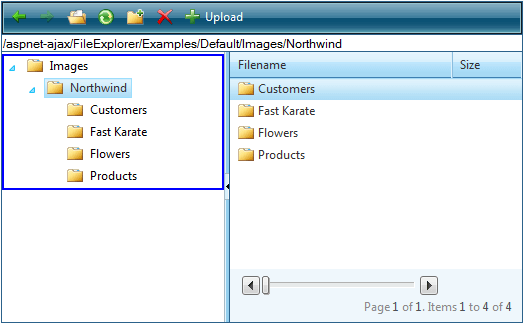

# Keyboard Support

Starting from Q1 2011 user-defined keyboard shortcuts can be set to the FileExplorer control. This improves the accessibility of the control, and makes it easier to use.

All the shortcuts are controlled through the RadFileExplorer.**KeyboardShortcuts** property, which is of type Telerik.Web.UI.FileExplorer.**FileExplorerShortcut**. The full list of the **FileExplorerShortcut**'s properties can be found below. The shortcut properties should be specified by providing the string corresponding to the respective key.

* The alphanumeric keys are set using their corresponding characters (Letter case is ignored). For example setting RadFileExplorer. **KeyboardShortcuts.Open="O"** and RadFileExplorer.**KeyboardShortcuts.Delete="2"** will make the control open the files when "O" keys is pressed, and delete files when "2" key is pressed.

* The non-alphanumeric and modifier keys are set by using their corresponding string keyword. The keywords are fixed and created to be intuitive, so if you want to use the "Space" key to focus the grid, you should simply set the RadFileExplorer.**KeyboardShortcuts.FocusGrid** property to the string "space", or "SPACE", or "Space". Letter case is **ignored**. Here is the full list of keywords for the respective keys (upper case used for convenience):

* ENTER - corresponds to the "Enter" key

* HOME - corresponds to the "Home" key

* END - corresponds to the "End" key

* LEFT - corresponds to the "Left" arrow key

* RIGHT - corresponds to the "Right" arrow key

* UP - corresponds to the "Up" arrow key

* DOWN - corresponds to the "Down" arrow key

* PAGEUP - corresponds to the "Page Up" key

* PAGEDOWN - corresponds to the "Page Down" key

* SPACE - corresponds to the "Spacebar" key

* TAB - corresponds to the "Tab" key

* BACK - corresponds to the "Backspace" key

* CONTEXT - corresponds to the ["(Context) Menu"](http://en.wikipedia.org/wiki/Menu_key) key

* ESCAPE оr ESC - correspond to the "Escape" key

* DELETE or DEL - correspond to the "Delete" key

* INSERT or INS - correspond to the "Insert" key

* PLUS - corresponds to the "+" key

* CTRL - corresponds to the "Ctrl" key

* ALT - corresponds to the "Alt" key

* SHIFT - corresponds to the "Shift" key

* F1, F2, through F12 - correspond to "f1", "f2", through "f12" keys (function keys)

* The modifier keys can be combined with the alphanumeric keys, to use a keyboard shortcut combination for executing a certain action. This is done by concatenating the shortcuts keywords with the "+" sign. Example, setting RadFileExplorer.**KeyboardShortcuts.FocusFileExplorer="CTRL+2"** will focus the control when pressing "Ctrl + 2".

There are number of predefined shortcuts, which can be used without the need to set any properties, and are enabled on every instance of the RadFileExplorer control.

Default shortcuts:

* **Enter**- open selected file or folder in the TreeView or Grid. Select folder/file in TreeView.

* **Esc** - close any opened Popup Window. Cancel rename operation in TreeView.

* **Delete** - delete selected file, folder in the Grid or TreeView. Note, that you need to press "Enter" to select a folder in the TreeView.

* ["(Context) Menu"](http://en.wikipedia.org/wiki/Menu_key) - open/close the Context Menu of the TreeView or the Grid, close to the selected file or folder.

	

* **"Arrow Keys"** - used to navigate through the items in the TreeView, Grid, Context Menu and the paging slider of the Grid.

Standard keyboard navigation:

* Use **Tab** or **Shift + Tab** to navigate through the items (tools) of the ToolBar

* Use **Tab** or **Shift + Tab** to navigate through the different controls of the FileExplorer, i.e. ToolBar, AddressBar, TreeView, Grid.

How to style the focused(active) controls?

A visual indication that the user is currently interacting with one of the FileExplorer controls, can substantially improve the user experience and ease of access. With a bit of custom CSS code we can change the look of the active controls (Grid, ToolBar, and etc):

1. First the RadFileExplorer's CssClass property needs to be set to (any) desired class. In this example we will use **rfeFocused**.

1. Use the following CSS code to set blue border to active controls. Note, that you could use the same selectors to apply your desired style.
		
	**CSS**	
		
		.rfeFocused:focus,
		.rfeFocused.RadTreeView:focus,
		.rfeFocused.RadGrid:focus,
		.rfeFocused.RadToolBar:focus
		{ 
			border: 2px solid Blue !important;
		} 

	

>caption Table 1: FileExplorerShortcut properties

|  **Property**  |  **Description**  |
| ------ | ------ |
| **FocusFileExplorer** |Gets or sets the keyboard shortcut used to bring the focus to the FileExplorer control.|
| **FocusTreeView** |Gets or sets the keyboard shortcut used to bring the focus to the TreeView of the FileExplorer control.|
| **FocusToolBar** |Gets or sets the keyboard shortcut used to bring the focus to the ToolBar of the FileExplorer control.|
| **FocusGrid** |Gets or sets the keyboard shortcut used to bring the focus to the Grid of the FileExplorer control.|
| **FocusAddressBar** |Gets or sets the keyboard shortcut used to bring the focus to the Address of the FileExplorer control.|
| **PopupWindowClose** |Gets or sets the keyboard shortcut used to close the RadWindow that is opened to view/upload/delete/create a file in the FileExplorer control. Default value **"Esc"** .|
| **FocusGridPagingSlider** |Gets or sets the keyboard shortcut used to bring the focus to the Slider used for paging in the Grid of the FileExplorer control.|
| **ContextMenu** |Gets or sets the keyboard shortcut used to open the context menu. Default value **"Context"** .|
| **Back** |Gets or sets the keyboard shortcut used to navigate one view Back (if possible) of the FileExplorer control.|
| **Forward** |Gets or sets the keyboard shortcut used to navigate one view Forward (if possible) of the FileExplorer control.|
| **Open** |Gets or sets the keyboard shortcut used to open the selected file or folder.|
| **Refresh** |Gets or sets the keyboard shortcut used to refresh the content of the FileExplorer.|
| **NewFolder** |Gets or sets the keyboard shortcut used to create new folder in the FileExplorer.|
| **Delete** |Gets or sets the keyboard shortcut used to delete the currently selected file or folder in the FileExplorer control. Default value **"Delete"** .|
| **UploadFile** |Gets or sets the keyboard shortcut used to upload a new file to the FileExplorer control.|
