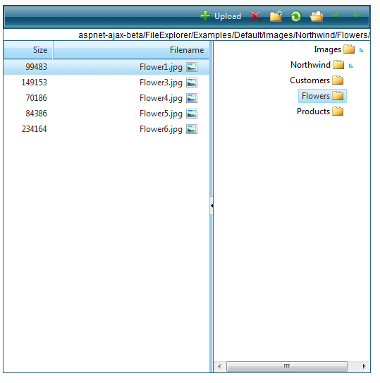

# Right-to-left Support


## 

The __RadFileExplorer__ fully supports right-to-left (RTL) language locales. In order to turn on the RTL support you should set __dir=rtl to the html or body__ element or to its parent element.

````ASPNET
	    <div style="direction: rtl;">
	         <telerik:RadFileExplorer runat="server" ID="FileExplorer1" Width="520px" Height="520px">
	             <Configuration ViewPaths="~/Images" UploadPaths="~/Images"
	                 DeletePaths="~/Images" />
	         </telerik:RadFileExplorer>
	     </div>
````



# See Also

 * [See this live in an online demo](http://demos.telerik.com/aspnet-ajax/fileexplorer/examples/righttoleftsupport/defaultcs.aspx)
