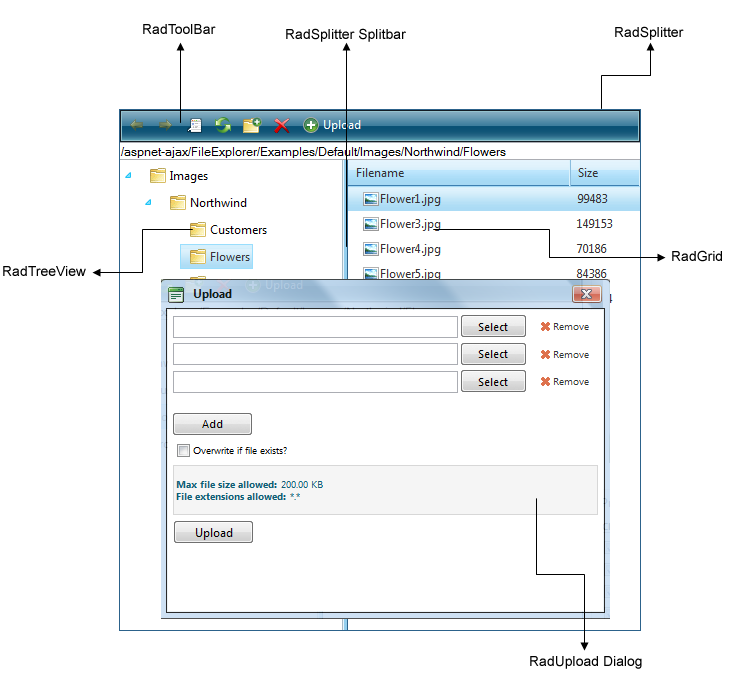

# Create a Custom Skin

AbstractEach of the controls included in the **Telerik UI for ASP.NET AJAX** suite is styled with two CSS files that are loaded in a certain order. The first one - **ControlName.css,** also called base stylesheet contains CSS properties and values that are common for all skins, i.e it is layout-specific, not skin-specific. These are CSS float, padding, margin, font-size, font-family, etc. In the general case, when creating a custom skin for a control this file should not be edited, unless the custom skin needs different sizes, padding and/or margins.

The second file represents the actual skin of the control, and its name consists of the control name plus the skin name, i.e -**FileExplorer.Default.css**. Upon creating a custom skin for the control, one should edit that particular file, as it contains skin-specific CSS properties, and references to images, colors, borders and backgrounds.

From **Q2 2010**, skin specific style sheet files have been created for all **RadFileExplorer** skins. They contain some skin specific colors and borders, and navigation toolbar buttons.

The navigation toolbar buttons are all place in a sprite image: FileExplorerToolbarSprites.png for all browsers and **FileExplorerToolbarSpritesIE6**.gif for Internet Explorer 6 only. Both images are exactly the same, but because IE6 cannot render PNG files properly we use PNG for other browsers and GIF for IE6. From Q2, 2010, that Sprite image is skin specific for every Telerik Skin, and it is placed in the **FileExplorer** folder related to the skin.


The **RadFileExplorer** control consists of several controls from Telerik AJAX UI Suite: **RadToolBar**, **RadGrid**, **RadTreeView**, **RadUpload**, **RadSplitter**. And each of that controls is styled with two CSS files that are loaded in a certain order.

Another change from Q2 2010 is that the Dialog Separator in **RadEditor’s** Dialogs has been changed to be specific for each different skin. Until now, it was grey colored for all skins and its CSS selector was placed in Widgets.css. Its width was also increased from 3px to 5px.

````CSS
.DialogSeparator
{
	border-left: solid 1px #222;
	border-right: solid 1px #222;
	background-color: #ececec;
}
````


As of **Q2 2010**, the above CSS code was removed from **Widgets.css** and moved to **FileExplorer** CSS skin specific files in order to have skin specific **DialogSeprator**.




The **FileExporer.css** file defines the common values for the control and all skins. It also rewrites some of the styles form **RadToolBar**, **RadGrid**, **RadTreeView**, **RadUpload**, **RadSplitter**. This is needed in order to make the control work properly. In that CSS file there are also skin specific settings for all skins which define some basic styles like colors and border colors of the **FileExplorer’s** wrapping elements to match the other controls’ skins.

To customize **RadFileExplorer** look and feel you should customize one or more of the skins of the controls that are used for **RadFileExplorer** - **RadToolBar**, **RadGrid**, **RadTreeView**, **RadUpload**, **RadSplitter**.

## See Also

* [Creating Custom RadToolBar Skin]()

* [Creating Custom RadGrid Skin]()

* [Creating Custom RadTreeView Skin]()

* [Creating Custom RadUpload Skin]()

* [Creating Custom RadSplitter Skin]()
