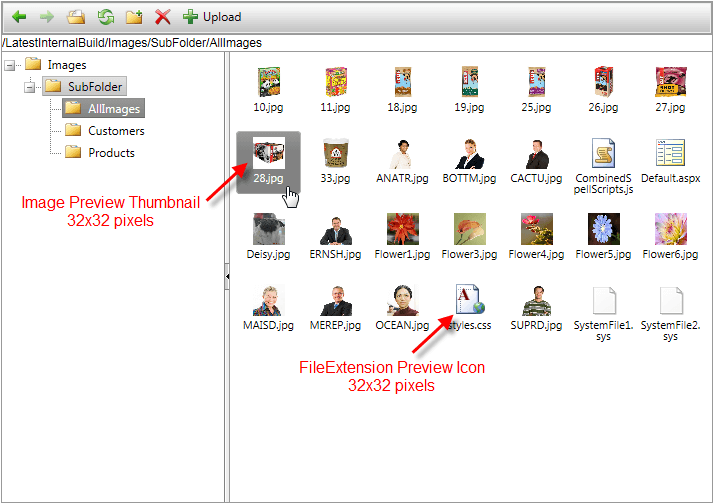
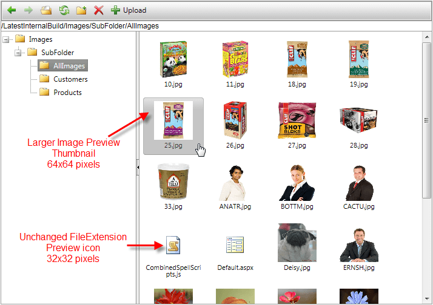

# Increase Thumbnail Dimensions


## 

The thumbnail item of the **RadFileExplorer** consists of an image preview icon or a folder/extension icon (txt, doc, pdf, js, etc) as shown below, e.g.:

By default, the thumbnail items of the **RadFileExplorer** have built-in dimension of 65x65px along with the image preview/extensionicons' size of 32x32px. The **RadFileExplorer** offers one additional built-in larger item size of 100x100px. Note that the built-in extension icon will be rendered as 32x32px, but the image preview thumbnail icon will be shown as 64x64px. To enable this mode set the **CssClasses** property to **rfeLargeThumbnails**:

````ASPNET
	    <telerik:RadFileExplorer ID="RadFileExplorer1" runat="server" ExplorerMode="Thumbnails" CssClass="rfeLargeThumbnails">
	    </telerik:RadFileExplorer>
````


Here is the final result:

It is also possible to define custom size for Thumbnail items by overwriting the **.rfeLargeThumbnails** class, e.g.

````JavaScript
	    /* Large thumbnails */
	    .rfeLargeThumbnails .rfeThumbList
	    {
	           width: 100px !important; /*defines thumbnail wrapper dimension*/
	    }
	    .rfeLargeThumbnails .rfeThumbList .rfeFile
	    {
	          /*the sum of the height and padding-top values should be equal to the height property defined in the rfeLargeThumbnails class*/
	           width: 64px !important;
	           height: 44px !important;
	           padding-top: 20px !important;
	    }
	    .rfeLargeThumbnails .rfeThumbList .rfeImageFile.rfeFile
	    {
	           height: 64px !important;
	           padding-top: 0 !important;
	    }
	    .rfeLargeThumbnails .rfeThumbList .rfeFile img
	    {
	          /*defines Image Preview Thumbnail dimension*/
	           width: 64px !important;
	           height: 64px !important;
	    }
	
````


In more specific scenarios, you can play with the above CSS using Firebug or IE development toolbar to achieve the desired thumbnail size appearance.
