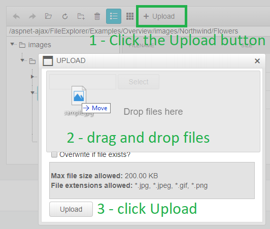

# Drag and Drop Files

**RadFileExplorer** supports drag and drop of files for two distinct actions:

* [uploading files to the server](#uploading-files)
* [moving files from one folder to another](#moving-files)

Below you can find more information for configuring these feaures and how they work.

## Uploading Files

When the async upload tool is enabled (`EnableAsyncUpload="true"`, which is the default value since Q2 2015), you can drag and drop files for upload. This is based on the [Drag and Drop Upload feature in RadAsyncUpload]().

Note that in order for the Upload button to be available, the `UploadPaths` must include the current folder.

There are two places you can drop a file:

* the Upload window:
 
    

* the file list:
 
    

## Moving Files

You can drag a file from the file list on the right hand side to the treeview on the left hand side in order to move it to the desired folder.

Note that both folders must have write permissions (i.e., be included in the `DeletePaths` and `UploadPaths`).

 

 Dragging a file in the file list only is not available.

