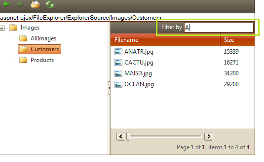

# Filter Items


## Filter items in FileExplorer

Starting from Q1 2011 the users can filter the files and folders in the FileExplorer's Grid. Setting the __EnableFilterTextBox__ property to __true__ will render a search box above the Grid's header. Note that the FileExplorer searches for the keyword in the currently selected directory, omitting the items in the subfolders.

These are the properties the related to the Filtering functionality:

* __EnableFilterTextBox__ - When set to true, renders a textbox used to filter files in the grid.

* __EnableFilteringOnEnterPressed__ - When set to true, performs the filtering after the "Enter" key is pressed. Its default value is __false__ which means the items are filtered on every keystroke. Note that, the filter box must be enabled for this property to be considered, i.e. the previous property must be set to true.

* __FilterTextBoxLabel__ - Gets or sets the text of the label displayed next to the Filter TextBox.

* __OnClientFilter__ - The name of the JavaScript function called when the user filters the files in the grid.

The *__filter__* client-side event (__OnClientFilter__ property) is raised before the filtering occurs, and event argument object with the following properties and methods is passed to the event handler method:

* __get_text()__ - gets the text (keyword) to search for

* __set_text(newText)__ - sets the text (keyword) to search for

* __set_cancel(toCancel)__ - sets bool value that determines whether the filtering will be cancelled. For example, set_cancel(true) will cancel the filtering process.

* __get_domEvent()__ - gets a reference to the current domEvent object - it comes handy when you need to determine which key was pressed

It is not necessary to have the built-in filter textbox enabled in order to perform filtering. The FileExplorer's __filter(__ client-side method can be used to filter the items in the currently selected directory. For example the following code performs the search from a user-defined textbox on every key stroke.

````ASPNET
	    <telerik:RadScriptManager ID="RadScriptManager1" runat="server">
		<script type="text/javascript">
		    function Search(txt)
		    {
		        var keyWord = txt.value;
		        var fileExplorer = $find("<%=RadFileExplorer1.ClientID %>");
		        //Search for the keyword
		        fileExplorer.filter(keyWord);
		    }
		</script>
	
		<div>
			<span>Search:</span><input type="text" onkeyup="Search(this); return false;" />
			<telerik:RadFileExplorer ID="RadFileExplorer1" runat="server" PageSize="4" AllowPaging="true">
				<Configuration ViewPaths="~/Images/Northwind/" UploadPaths="~/Images/Northwind/"
					DeletePaths="~/Images/Northwind/" />
			</telerik:RadFileExplorer>
		</div>
````


