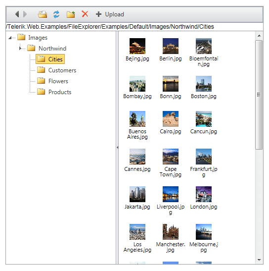

# Thumbnails Mode

Since Q1 2012 the **RadFileExplorer** offers the Thumbnails Explorer mode. This is a new way to display the list of files, just as you would expect in Windows Explorer. The special feature is displaying images through thumbnails, not as file icons. This view utilizes the **RadListView** control and its newly implemented [Client-Side binding]().

You can enable this mode by setting the **ExplorerMode** property to **Thumbnails**, e.g.

````ASP.NET
<telerik:RadFileExplorer RenderMode="Lightweight" runat="server" ID="FileExplorer1" ExplorerMode="Thumbnails"></telerik:RadFileExplorer>
````



## See Also

[ListView Client-side Data Binding Overview]()
