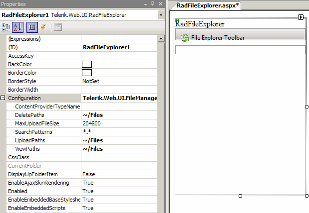

# Getting Started

## 

Here are the basic steps to insert a __RadFileExplorer__ control on your page:

1. Create a new ASP.NET AJAX - enabled web site.

1. Add a __RadScriptManager__ or the standard ASP ScriptManager to the page - this step is mandatory if you are using ASP.NET AJAX controls.

1. Drag a RadFileExplorer from your VS Toolbox and drop it on the page.

1. Right-click on the inserted RadFileExplorer control and select properties.

1. Set the following properties in the Configuration section: ViewPaths, DeletePaths and UploadPaths in the following format: __~/<path>__ where the tilde (~) represents the root of your web application.
>caption 

1. You can additionally set properties for the RadGrid, RadTreeview and RadToolbar controls which will allow you to modify the look and behavior of RadFileExplorer so it fully matches your requirements.

1. Save the page and run it in the browser.

