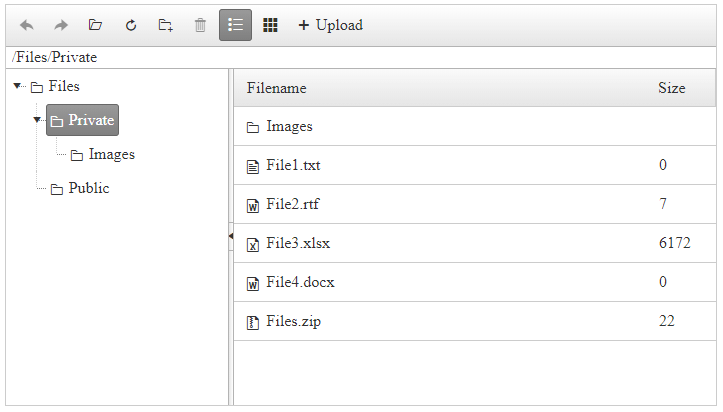

# Getting Started

The following tutorial demonstrates how to create a simple **RadFileExplorer** control in three possible ways (the end result will be similar to **Figure 1**):

* [Declaratively](#create-radtileexplorer-declaratively)
* [Programmatically](#create-radfileexplorer-programmatically)
* [In Visual Studio Design Time](#create-radfileexplorer-using-visual-studio-design-time)


>caption **Figure 1**: A RadFileExplorer configuration with sample paths:


## Create RadFileExplorer Declaratively

In the steps below you will see how to declare a simple **RadFileExplorer** in the markup:

1. Add a **RadScriptManager** control on a Web Form.

1. Add a **RadFileExplorer** control on this AJAX-enabled Web Form.

1. Create a *"Files"* folder placed in the root of the same application and add several nested folders to it (or use an already existing folder). Set the paths of **RadFileExplorer** in its `Configuration` sub tag, depending on the permissions you want to give to each of them. The paths should be virtual (with "~" sign in the begining):
    * **`ViewPaths`** - the user will have read permissions to the set paths (and its child folders)
    * **`DeletePaths`** - the user will have delete permissions to the set paths (and its child folders)
    * **`UploadPaths`** - the user will have upload permissions to the set paths (and its child folders)


1. If you want to show the content of а specific folder when RadFileExplorer is initially loaded, you can configure its `InitialPath` property.

>note The value set to the `InitialPath` property is case sensitive and should be in the same format as shown in the RadFileExplorer's addressbar. 

1. Configure the file types which will be visible in the control (the default value is "*.*", showing all file types) thorugh the `SearchPatterns` Configuration property.

1. The final result should be similar to:

	**ASP.NET**
	
	    <telerik:RadScriptManager runat="server"></telerik:RadScriptManager>
	    
        <telerik:RadFileExplorer ID="RadFileExplorer1" runat="server" InitialPath="/Files/Private">
            <Configuration ViewPaths="~/Files" DeletePaths="~/Files/Private" UploadPaths="~/Files" SearchPatterns="*.txt, *.xlsx, *.docx, *.rtf, *.zip"/>
        </telerik:RadFileExplorer>

1. Save the page and run it in the browser.

## Create RadFileExplorer using Visual Studio Design Time

Here are the basic steps to insert a **RadFileExplorer** control on your page:

1. Create a new ASP.NET AJAX - enabled web site.

1. Add a **RadScriptManager** or the standard ASP ScriptManager to the page - this step is mandatory if you are using ASP.NET AJAX controls.

1. Drag a RadFileExplorer from your VS Toolbox and drop it on the page.

1. Right-click on the inserted RadFileExplorer control and select properties.

1. Set the following properties in the Configuration section: ViewPaths, DeletePaths and UploadPaths in the following format: **~/\<path\>** where the tilde (~) represents the root of your web application.
	
	

1. You can additionally set properties for the RadGrid, RadTreeview and RadToolbar controls which will allow you to modify the look and behavior of RadFileExplorer so it fully matches your requirements.

1. Save the page and run it in the browser.

## Create RadFileExplorer Programmatically

In the sample below you will see how to create RadFileExplorer entirely on the server-side. From the server you have also access to the controls nested in RadFileExplroer (like Grid and Splitter), so you can set their properties here as well.

````C#
    protected void Page_Load(object sender, EventArgs e)
    {
        RadFileExplorer fileExplorer = new RadFileExplorer();
        fileExplorer.ID = "RadFileExplorer1";
        fileExplorer.Width = Unit.Pixel(600);
        fileExplorer.Height = Unit.Pixel(600);

        //Set RadFileExplorer's paths
        fileExplorer.Configuration.ViewPaths = new string[] { "~/Files" };
        fileExplorer.Configuration.UploadPaths = new string[] { "~/Files/Private" };
        fileExplorer.Configuration.DeletePaths = new string[] { "~/Files/Public" };

        //Set the visible file types
        fileExplorer.Configuration.SearchPatterns = new string[] { "*.txt", "*.xlsx", "*.docx", "*.rtf", "*.zip" };

        //Set RadFileExplorer's MaxUploadFileSize
        fileExplorer.Configuration.MaxUploadFileSize = 10485760;

        // Enable the Paging on the Grid and set the page size
        fileExplorer.AllowPaging = true;
        fileExplorer.PageSize = 20;

        Page.Form.Controls.Add(fileExplorer);
    }
````

````VB
    Protected Sub Page_Load(ByVal sender As Object, ByVal e As EventArgs)
        Dim fileExplorer As RadFileExplorer = New RadFileExplorer()
        fileExplorer.ID = "RadFileExplorer1"
        fileExplorer.Width = Unit.Pixel(600)
        fileExplorer.Height = Unit.Pixel(600)

        'Set RadFileExplorer's paths
        fileExplorer.Configuration.ViewPaths = New String() {"~/Files"}
        fileExplorer.Configuration.UploadPaths = New String() {"~/Files/Private"}
        fileExplorer.Configuration.DeletePaths = New String() {"~/Files/Public"}

        'Set the visible file types
        fileExplorer.Configuration.SearchPatterns = New String() {"*.txt", "*.xlsx", "*.docx", "*.rtf", "*.zip"}

        'Set RadFileExplorer's MaxUploadFileSize
        fileExplorer.Configuration.MaxUploadFileSize = 10485760

        'Enable the Paging on the Grid and set the page size
        fileExplorer.AllowPaging = True
        fileExplorer.PageSize = 20

        Page.Form.Controls.Add(fileExplorer)
    End Sub
````

# See Also

* [Server-side API]()
* [Configure RadFileExplorer on the Server]()
* [Design Time]()

