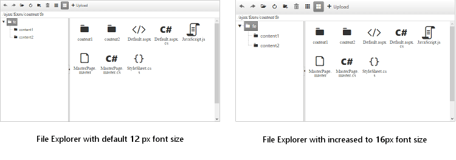

# Elastic Design


This article explains the **elastic design capabilities RadFileExplorer offers**. The [Lightweight RenderMode]() of RadFileExplorer supports **elastic design as of Q3 2015** (**Figure 1**).

@[template](/_templates/common/render-mode.md#resp-design-desc "slug-el: no, slug-fl: no")


>caption Figure 1: Comparison between the appearance of a RadFileExplorer with regular font size and with increased font size (50% scale).




**RadFileExplorer** does not create elastic design by itself, but can fit in a page that follows this pattern. This means that its **Lightweight RenderMode** supports **changing the font size** without breaking the control's appearance - if the new size is larger than the original, the elements in the control will simply increase their size as well to accommodate the text. This fluid layout is achieved by using `em` units for setting dimensions and paddings in the control, instead of `px`because `em` units are tied to the font size. This allows dimensions and sizes to scale with the font size.

>important As of Q3 2015 only the some child controls of the File Explorer are elastic (i.e., take the font size from the CSS) and they require separate CSS rules. These are TreeView, ToolBar, Slider. The other controls are not elastic yet. This will be improved in future releases.


>caption **Example 1**: Changing the font-size of a File Explorer. The result is shown in Figure 1. 

````ASP.NET
<style type="text/css">
	div.RadFileExplorer div.RadToolBar,
	div.RadFileExplorer div.RadTreeView,
	div.RadFileExplorer div.RadSlider
	{
		font-size: 16px;
	}
</style>
<telerik:RadFileExplorer RenderMode="Lightweight" ID="RadFileExplorer1" runat="server" PageSize="15" AllowPaging="true" ExplorerMode="Thumbnails">
	<Configuration ViewPaths="~/MyFolder" UploadPaths="~/MyFolder" DeletePaths="~/MyFolder" />
</telerik:RadFileExplorer>
````


# See Also


 * [Render Modes]()


