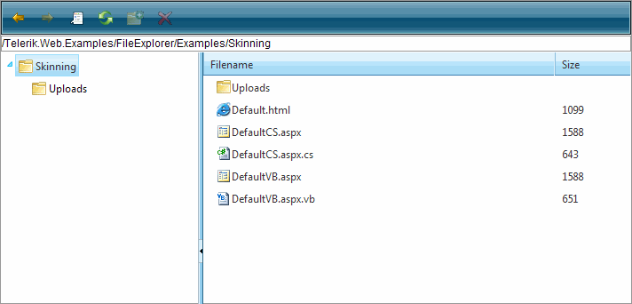
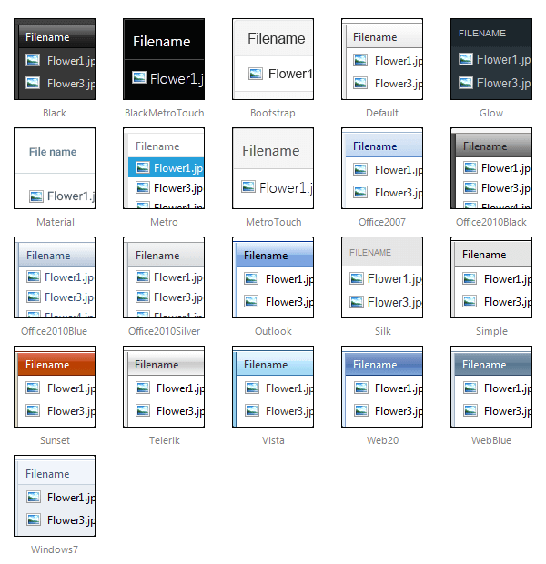

# FileExplorer Overview

**RadFileExplorer** is a part of the Telerik® UI for ASP.NET AJAX suite and it is officially included in the suite in Q1 2009. It allows you to easily add a file explorer functionality to your pages providing your users with the ability to organize files and folders directly from the web page.

## Main features:

* A single control, integrated in Telerik.Web.UI - ready to drag and drop on the page

* Directory load on demand loading using ASP.NET 2.0 AJAX Callback mechanism

* Client side and server events for file operations

* Uses the FileBrowserContentProvider abstraction of RadEditor for hooking to any underlying file system, such as OS, database, MOSS SharePoint, FTP, cloud services and more...

* Sorting of files and folders

* Context menus

* Ability to delete and rename files and folders

* Ability to create new folders

RadFileExplorer is installed with a number of preset skins. They are shown below:

