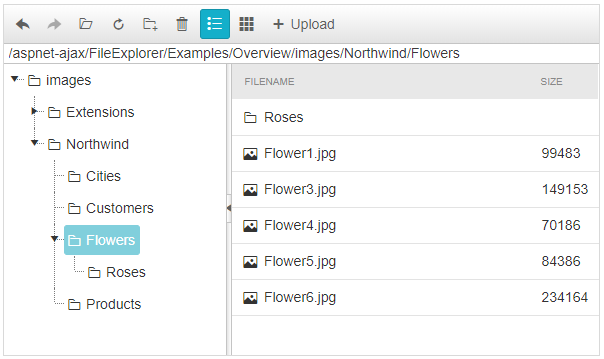

# FileExplorer Overview

**RadFileExplorer** is a part of the Telerik® UI for ASP.NET AJAX suite and it is officially included in the suite in Q1 2009. It allows you to easily add a file explorer functionality to your pages providing your users with the ability to organize files and folders directly from the web page.

## Main features:

* A single control, integrated in Telerik.Web.UI - ready to drag and drop on the page

* Directory load on demand loading using ASP.NET 2.0 AJAX Callback mechanism

* [Client-]() and [server-side]() events for file operations

* Uses the [FileBrowserContentProvider]() abstraction of RadEditor for hooking to any underlying file system, such as OS, database, MOSS SharePoint, FTP, cloud services and more...

* Sorting of files and folders

* Context menus

* Ability to delete and rename files and folders

* Ability to create new folders

RadFileExplorer is installed with a number of preset skins. They are shown below:

## See Also
 * [RadFileExplorer Overview demo](https://demos.telerik.com/aspnet-ajax/fileexplorer/examples/overview/defaultcs.aspx)
 
 * [RadFileExplorer Getting Started]()

 
 

