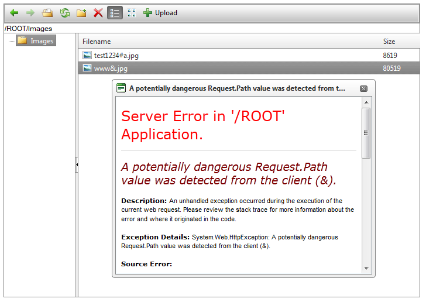
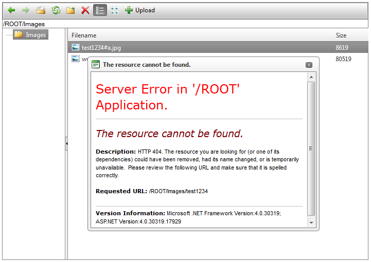

# Restricted Symbols

There are some sets of symbols, which use in a URL path is considered as restricted, saved or invalid and should be avoided.	Above you can find a list of the main errors that are thrown in case you are using any of these characters:

## Server error: A potentially dangerous Request.Path value was detected from the client (&).



This error is not caused by **RadFileExplorer's** limitation, but indicates that the publishing was cancelled due to the ASP.NETvalidators detecting a dangerous input in the request path. This information concerns the following characters: **<,>,*,%,&,:,\**. You could predefine the set of the restricted symbols by both setting `ValidateRequest="false"` to the declaration of the page,containing the Editor and adding the [requestPathInvalidCharacters](http://msdn.microsoft.com/en-us/library/system.web.configuration.httpruntimesection.requestpathinvalidcharacters.aspx) in the `<httpRuntime>` section of the *web.config*:

````XML
<system.web>
	<httpRuntime requestPathInvalidCharacters="" />
</system.web>
````

## Server Error: The resource cannot be found.



There is another set of characters, which are told to be reserved or/and unsaved ones (e.g., **#, %, ?, /**, etc.). Even if you configure your application to skip the path validation (refer the previous Section of this article), there will remain symbols, which could not be used as a path to a file. You can find detailed information about them here: [W3C Recommendations](http://www.w3.org/Addressing/URL/4_URI_Recommentations.html).

## Error Message: Filename is Invalid or Cannot Contain Any of the Following Characters.


There is a third set of characters, which are restricted by the operating system itself. If the content of the **RadFileExplorer** is not taken	from the file system (e.g., from a Data Base) these characters have to be avoided.

You can see a way to prevent the use of all restricted symbols in FileExplorer it in this KB article: [How to notify the user that an image with invalid file name is being uploaded](http://www.telerik.com/support/kb/aspnet-ajax/editor/notify-the-user-for-image-with-invalid-file-name-is-uploaded.aspx).
