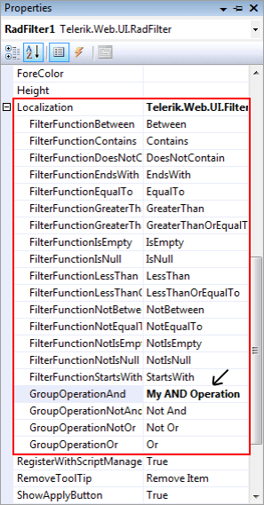
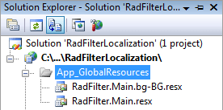
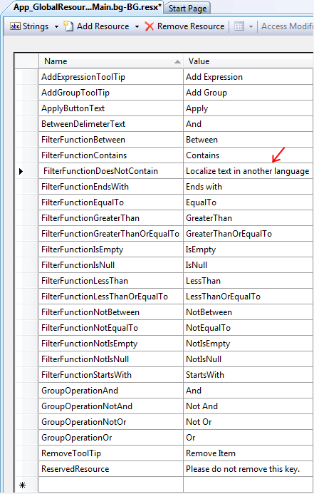
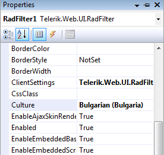

# Localization


The localization support for **RadFilter** lets you completely translate the user interface, or simply adapt a few strings.

## Localization Property

The Localization property specifies the strings that appear in the runtime user interface of the filter, including the message pop-up dialogs and edit forms. By changing the values of each named sub-property, you change the appearance of the string the RadFilter uses:

````ASPNET
<telerik:RadFilter ID="RadFilter1" runat="server">
    <Localization GroupOperationAnd="My AND Operation" />
</telerik:RadFilter>
````



The RadFilter control extracts the header text from the grid column when filter container is the RadGrid control and use it as DisplayName. In case of other container control by default RadFilter uses the FieldName as DisplayName. In case of declarative field editors you could customize the name of the fields displayed in RadFilter as shown bellow:

````ASPNET
<telerik:RadFilter ID="RadFilter1" runat="server" Culture="bg-BG">
    <Localization GroupOperationAnd="My AND Operation" />
    <FieldEditors>
        <telerik:RadFilterTextFieldEditor FieldName="Name1" DisplayName="Custom Text" />
    </FieldEditors>
</telerik:RadFilter>
````


To customize the name of the fields when using filter container control you could set meaningful HeaderText in the columns in RadGrid or handles **OnFieldEditorCreated** server-side event to modify the **DisplayName** of **RadFilter** editor programmatically.


````ASPNET
<telerik:RadFilter runat="server" ID="RadFilter1" Culture="bg-BG" FilterContainerID="RadGrid1"
    OnFieldEditorCreated="RadFilter1_FieldEditorCreated" ShowApplyButton="true">
</telerik:RadFilter>
````
````C#
protected void RadFilter1_FieldEditorCreated(object sender, RadFilterFieldEditorCreatedEventArgs e)
{
    if (e.Editor.FieldName == "OrderID")
    {
        e.Editor.DisplayName = "Your custom text";
    }
}
````
````VB.NET
Protected Sub RadFilter1_FieldEditorCreated(ByVal sender As Object, ByVal e As RadFilterFieldEditorCreatedEventArgs)
    If e.Editor.FieldName = "OrderID" Then
        e.Editor.DisplayName = "Your custom text"
    End If
End Sub
````


## Global Resource Files

The primary means for localization in ASP.NET is to use resource files. Resource files are simple XML files that can be easily edited and transferred to other applications. You can use resource files to change the default (English) localization for RadFilter that is stored in the Telerik.Web.UI assembly.

>note RadFilter's default **Culture** is taken from the page's **CurrentUICulture** .
>


To create a global resource file to localize the filter:

1. Create the **App_GlobalResources** folder in the root of your web application.

1. Copy the default resource **RadFilter.Main.resx** file into it. This file can be found in the App_GlobalResources folder of the directory where you installed the Telerik controls.

1. Make a copy of the file and rename the copy so that its name contains the Culture Identifier. The resource files used by RadFilter follow a strict naming convention:**RadFilter.Main.<Culture Identifier>.resx**

>note  **The Culture Identifier consists of a language code followed by a dash and the country code. Example: “en-US”, “fr-CA”, “bg-BG” and so on.** 
>
For example RadFilter.Main.bg-BG.resx. Both files should be present in the App_GlobalResources folder:


1. Edit the strings using the Visual Studio editor or your favorite text editor. Customize strings just as you would set the Localization property.


>caution Make sure that the ReservedResource message is preserved. It is used for identification purposes and is never displayed.
>


You can now switch the filter so that it uses your new resource file by setting the active culture:

