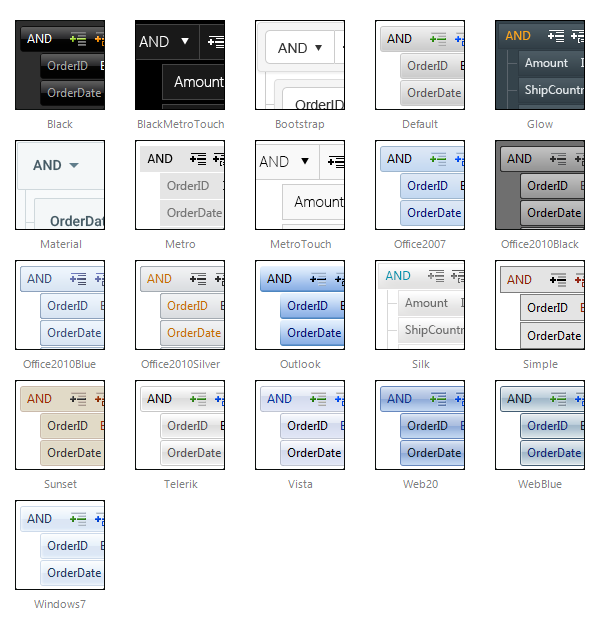

# Skins

RadFilter uses skins to control its overall look-and-feel. A skin is a set of images and a CSS stylesheet that can be applied to the control elements (items, images, etc.) and defines their look and feel. By default all controls in Telerik controls for ASP.NET AJAX suite have a polished look and feel which is consistent across the whole product line.

## Built-in skins

These are the skins provided by Telerik. They are embedded in the **Telerik.Web.UI.dll** assembly as web resources. To use a built-in skin the user only needs to set the *Skin* property of the control. Built-in skins are also provided in **"C:\Program Files\Progress\UI for ASP.NET AJAX RX YYYY\Skins"**.

Below is a set of the Telerik RadFilter skins:
 

 @[template - Material skin is available only in Lightweight mode](/_templates/common/skins-notes.md#material-only-in-lightweight) 

>note The **Hay** , **Forest** , **Sitefinity** and **Transparent** skins are obsolete and have been removed from the **Telerik.Web.UI.Skins.dll** assembly as of **Q1 2014** .	You can find more information on the matter in[this blog post](http://blogs.telerik.com/aspnet-ajax/posts/13-04-11/6-telerik-asp.net-ajax-skins-going-obsolete).
>

## Custom skins

These are skins created by the developer. They are not embedded so the control cannot register them automatically. If you use a custom skin you need to set the *Skin* property, and the *EnableEmbeddedSkins* property of the control to false. If you do not do so, an exception will be thrown saying that there is no embedded skin matching the Skin property

Please examine the [Creating a custom skin]() help topic for additional information.

## See Also

 * [Telerik ThemeBuilder for ASP.NET AJAX](http://themebuilder.telerik.com/)

