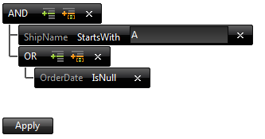

# Client-Side Programming Overview


This help articles demonstrates how to get reference to the RadFilter client object and cover its main properties, methods and events.

## Getting RadFilter client object

To get reference of the RadFilter client-side object, you can use one of the following approaches:

* Using the __$find(id)__ method (shortcut for the findComponent() method) of the ASP.NET AJAX framework:

````ASPNET
	        <telerik:RadCodeBlock ID="RadCodeBlock1" runat="server">
	            <script type="text/javascript">
	                function GetRadFilter() {
	                    var filter = $find("<%= RadFilter1.ClientID %>");
	                }
	            </script>
	        </telerik:RadCodeBlock>
````


* Subscribing for the __OnFilterCreated__ client-side event of the control. In its handler the *sender* argument references the RadFilter client object:

````ASPNET
	        <telerik:RadCodeBlock ID="RadCodeBlock2" runat="server">
	            <script type="text/javascript">
	                var filter = null;
	                function FilterCreated(sender, eventArgs) {
	                    filter = sender;
	                }
	            </script>
	        </telerik:RadCodeBlock>
	        <telerik:RadFilter ID="RadFilter1" runat="server">
	            <ClientSettings>
	                <ClientEvents OnFilterCreated="OnFilterCreated" />
	            </ClientSettings>
	        </telerik:RadFilter>
````


## Properties and events

The RadFilter provides the *.get_contextMenu()* property with which the RadContextMenu used for displaying the fields of the field editors and the filter functions is accessed. You can find more information on it in the [Customizing the Menu]() and [Enable Scrolling for ContextMenu in RadFilter]() help topics.

The following table lists the events you should be aware of when working with the RadFilter control:


>caption  

|  __Event__  |  __Description__  |
| ------ | ------ |
| __OnFilterCreated__ |This client-side event is fired after the RadFilter is created.|
| __OnFilterCreating__ |This client-side event is fired before the RadFilter is created.|
| __OnFilterDestroying__ |This client-side event is fired when RadFilter object is destroyed, i.e. on each window.onunload.|
| __OnMenuShowing__ |This client-side event is fired before the RadFilter.ContextMenu is shown.|
| __OnMenuShown__ |This client-side event is fired when the RadFilter.ContextMenu is shown.|

## Methods

The RadFilter provides means for client-side manipulation of its functionality. Below are listed the client-side methods of the RadFilter client object:


>caption  

|  __Method__  |  __Description__  |
| ------ | ------ |
| __fireCommand(command, argument)__ |Method which triggers the specific command with the corresponding arguments for the RadFilter when executed.|
| __addExpression(ownerIndex)__ |Method which adds a new expression at the level specified by the *ownerIndex* parameter.|
| __addGroup(ownerIndex)__ |Method which adds a new group at the level specified by the *ownerIndex* parameter.|
| __changeGroupOperator(ownerIndex, groupOperator)__ |Method which changes the group operation of the group at the level specified by the *ownerIndex* parameter to the value of the *groupOperator* parameter.|
| __changeFilterFunction(ownerIndex, filterFunction)__ |Method which changes the filter function of the expression at the level specified by the *ownerIndex* parameter to the value of the *filterFunction* parameter.|
| __changeExpressionFieldName(ownerIndex, fieldName)__ |Method which changes the field name of the expression at the level specified by the *ownerIndex* parameter to the value of the *fieldName* parameter.|
| __applyExpressions()__ |Method which raises the ApplyExpressions command.|

The following example shows how to add a new expression to the second group of the RadFilter below and how to change the root group operation:

````ASPNET
	       <telerik:RadFilter runat="server" ID="RadFilter1" Skin="Black">
	            <FieldEditors>
	                <telerik:RadFilterTextFieldEditor FieldName="ShipName" />
	                <telerik:RadFilterDateFieldEditor FieldName="OrderDate" />
	            </FieldEditors>
	        </telerik:RadFilter>
	        <input type="button" value="Add expression to filter" onclick="filterAddExpression();" />
	        <input type="button" value="Change group operation" onclick="filterGroupOperation();" />
	        <telerik:RadCodeBlock ID="RadCodeBlock1" runat="server">
	            <script type="text/javascript">
	
	                function filterAddExpression() {
	                    var filter = $find("<%= RadFilter1.ClientID %>");
	                    filter.addExpression("1_0");
	                }
	
	                function filterGroupOperation() {
	                    var filter = $find("<%= RadFilter1.ClientID %>");
	                    filter.changeGroupOperator("0", "Or")
	                }
	
	            </script>
	        </telerik:RadCodeBlock>
````


Here is the same RadFilter after the both buttons have been clicked:

>note Please note that all methods from the client-side API fire commands to the server and trigger a postback. If you have two or more subsequent calls to any of the client methods, only the last one will be executed.
>

