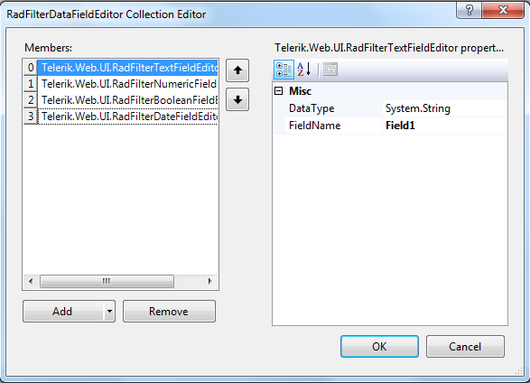
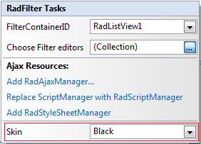

# Design Time

The RadFilter Smart Tag provides convenient access to the most common settings for the control. You can display the Smart Tag by right clicking on the **RadFilter** in the design window, and choosing the "Show Smart Tag" option from its context menu.

The options which are exposed through the Smart Tag are:

## DataFieldEditors

The data field editors collection allows you to customize the way filtering is performed. You can use one or more data field objects in a single **RadFilter** control, which will help the site visitor to filter the data visualized by its container control.

## RadStyleSheetManager

The **Add RadStyleSheetManager** link adds a **RadStyleSheetManager** to your Web page.

## RadAjaxManager

The **Add RadAjaxManager** link adds a RadAjaxManager to your Web page.

## Replace ScriptManager with RadScriptManager

The **Replace ScriptManager with RadScriptManager** link replaces the Microsoft Ajax Extensions ScriptManager with RadScriptManager.

## Skin

The **Skin** drop-down displays a list of available predefined skins that you can apply to **RadFilter** control. Assign a skin by selecting the one you want from the list.

