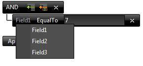

# Built-in


A standard declaration of the RadFilter control looks like this:

````ASPNET
<telerik:RadFilter RenderMode="Lightweight" runat="server" ID="RadFilter1" Skin="Black">
    <FieldEditors>
        <telerik:RadFilterTextFieldEditor FieldName="Field1" />
        <telerik:RadFilterNumericFieldEditor FieldName="Field2" DataType="System.Int32" />
        <telerik:RadFilterBooleanFieldEditor FieldName="Field3" />
    </FieldEditors>
</telerik:RadFilter>
````


The most important part of it are the FieldEditors. Each field editor declares a field, which will be correlated with a filter expression, for example:

**([Field1] = '7')**

In the code snippet above, we have declared three such RadFilterTextFieldEditors. Each one of them will be available as an option in the filter control. For example, one can choose a field, a filter option (e.g. "EqualTo") and a value, when building the filter expression, as demonstrated in the screenshot below:


>note Please note that when the *FilterContainerID* or the *DataSourceControlID* property is set, the RadFilter generates the field editors automatically.
>


## Field editors types

There are four types of build-in field editors:

1. **RadFilterBooleanFieldEditor** - this denotes a Boolean field. For a Boolean field, the filter list options are limited to EqualTo, NotEqualTo, IsNull and NotIsNull, followed by a checkbox, which would hold the true/false filter value, depending on its checked state.

1. **RadFilterNumericFieldEditor** - denotes a numeric field. It has more Filter options than the Boolean field, but the options are still limited to a numeric input - for example GreaterThan and LessThan. The input control, which is rendered is a numeric one, which limits the user input to numeric values only.

1. **RadFilterTextFieldEditor** - this field accepts any type of user input - alphabetical and numeric. It renders a standard textbox, which does not pose any restrictions on the user input. This filter type has the largest array of filter options.

1. **RadFilterDateFieldEditor** - this field allows the construction of a filter targeting dates. In addition to the field named and filter option, it renders a datetimepicker, which facilitates the selection of a date, and validates the user input, to ensure that a valid date is passed as the filter value.

1. **RadFilterMaskedTextBoxEditor** - allows to enter values for filtering using a RadMaskedTextBox control.

1. **RadFilterDropDownEditor** - allows the user to filter by predefined values which can be selected from a dropdown.

Additionally, you can create custom field editors as it is described [here]().

## Common properties of the field editors

The following table lists the common properties of the field editors:


>caption  

|  **Property**  |  **Description**  |
| ------ | ------ |
| **DataType** |Gets or sets the type of the data of the field.|
| **DisplayName** |Gets or sets the name displayed for the field.|
| **ToolTip** |Gets or sets the ToolTip property of the editor control|
| **DefaultFilterFunction** |Gets or sets the default filter function that will be set to the editor item when it is first created.|
| **FieldName** |Gets or sets the name of the field. This property will be used when the filter expression is built.|
| **PreviewDataFormat** |Gets or sets preview data format for the editor. This property will be used to format the value per editor when ExpressionPreviewPosition is different than *RadFilterExpressionPreviewPosition.None* |

## Properties of the RadFilterDateFieldEditor

Represents an editor used for filtering fields of DateTime type.


>caption  

|  **Property**  |  **Description**  |
| ------ | ------ |
| **MinDate** |Gets or sets the MinDate of the RadDatePicker control.|
| **PickerType** |Gets or sets what type of date control will be created. The default value is DateTimePicker.|
| **DateFormat** |Gets or sets the DateFormat and DisplayDateFormat that will be applied to the control.|

## Properties of the RadFilterDropDownEditor

Represents an editor for populating predefined items to be filtered using a drop down control


>caption  

|  **Property**  |  **Description**  |
| ------ | ------ |
| **DropDownType** |Gets or sets the type of drop down control which will be created. The default value is RadDropDownList.|
| **DataTextField** |Gets or sets the DataTextField property value of the drop down control created by the editor.|
| **DataValueField** |Gets or sets the DataValueField property value of the drop down control created by the editor.|
| **DataSourceID** |Gets or sets the DataTextField property value of the drop down control created by the editor.|

## Properties of the RadFilterMaskedTextBoxEditor

Represents an editor for filtering values using a RadMaskedTextBox control.


>caption  

|  **Property**  |  **Description**  |
| ------ | ------ |
| **Mask** |Gets or sets the Mask property of the RadMaskedTextBox control.|
| **DisplayMask** |Gets or sets the DisplayMask property of the RadMaskedTextBox control.|
| **PromptChar** |Gets or sets the PromptChar property of the RadMaskedTextBox control.|
| **DisplayPromptChar** |Gets or sets the DisplayPromptChar property of the RadMaskedTextBox control.|

## Properties of the RadFilterNumericFieldEditor

Represents an editor used for filtering fields of numeric type.


>caption  

|  **Property**  |  **Description**  |
| ------ | ------ |
| **NumericType** |Gets or sets the NumericType property of the RadNumericTextBox control.|
| **AllowRounding** |Gets or sets the NumberFormat.AllowRounding property of the RadNumericTextBox control.|
| **KeepNotRoundedValue** |Gets or sets the NumberFormat.KeepNotRoundedValue property of the RadNumericTextBox control.|
| **DecimalDigits** |Gets or sets the NumberFormat.DecimalDigits property of the RadNumericTextBox control.|

## Properties of the RadFilterTextFieldEditor

Represents the field editor in RadFilter used to build filter expressions for string values.


>caption  

|  **Property**  |  **Description**  |
| ------ | ------ |
| **TextBoxWidth** |Gets or sets the TextBox width in pixels.|

## Properties of the RadFilterBooleanFieldEditor

Represents an editor used for filtering fields of boolean type.


>caption  

|  **Property**  |  **Description**  |
| ------ | ------ |
| **DataType** |Gets the type of the field that is filtered using this editor.|
