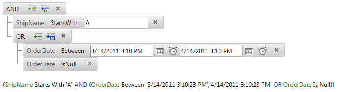

# Working with Expressions


Apart from building complex filtering criteria by means of the visual UI, RadFilter also provides the option of adding filter and group expressions programmatically. Saving and loading expressions is also supported.

## RadFilter FilterExpression types

The following table describes all filter expression types you can use:


>caption  

|  __FilterExpression type__  |  __Description__  |
| ------ | ------ |
| __RadFilterBetweenFilterExpression<T>__ |Represents Between RadFilter filter expression where __T__ is the type of the field on which filter will be applied.|
| __RadFilterNotBetweenFilterExpression<T>__ |Represents NotBetween RadFilter filter expression where __T__ is the type of the field on which filter will be applied.|
| __RadFilterContainsFilterExpression__ |Represents Contains RadFilter filter expression.|
| __RadFilterGreaterThanFilterExpression<T>__ |Represents GreaterThan RadFilter filter expression where __T__ is the type of the field on which filter will be applied.|
| __RadFilterGreaterThanOrEqualToFilterExpression<T>__ |Represents GreaterThan or EqualTo RadFilter filter expression where __T__ is the type of the field on which filter will be applied.|
| __RadFilterGroupFilterExpression__ |Represents a group of filter expressions.|
| __RadFilterIsEmptyFilterExpression__ |Represents IsEmpty RadFilter filter expression.|
| __RadFilterNotIsEmptyFilterExpression__ |Represents IsEmpty RadFilter filter expression.|
| __RadFilterNotIsNullFilterExpression__ |Represents IsNotNull RadFilter filter expression.|
| __RadFilterIsNullFilterExpression__ |Represents IsNull RadFilter filter expression.|
| __RadFilterLessThanFilterExpression<T>__ |Represents LessThan RadFilter filter expression where __T__ is the type of the field on which filter will be applied.|
| __RadFilterLessThanOrEqualToFilterExpression<T>__ |Represents LessThan or EqualTo RadFilter filter expression where __T__ is the type of the field on which filter will be applied.|
| __RadFilterEqualToFilterExpression<T>__ |Represents EqualTo RadFilter filter expression where __T__ is the type of the field on which filter will be applied.|
| __RadFilterNotEqualToFilterExpression<T>__ |Represents NotEqualTo RadFilter filter expression where __T__ is the type of the field on which filter will be applied.|
| __RadFilterStartsWithFilterExpression__ |Represents StartsWith RadFilter filter expression.|
| __RadFilterEndsWithFilterExpression__ |Represents EndsWith RadFilter filter expression.|

## Adding RadFilter expressions programmatically

You can create filter expressions as well as group expressions in the code behind. Please note that the group expressions should first be added to the RootGroup, and the filter expressions to be added to them.

In the following sample it is shown how to programmatically create a expression that filters the Orders table for orders with ShipName that starts with an 'A' and OrderDate either in the previous month, or not specified:


````ASPNET
	        <telerik:RadFilter runat="server" ID="RadFilter1" ExpressionPreviewPosition="Bottom">
	            <FieldEditors>
	                <telerik:RadFilterTextFieldEditor FieldName="ShipName" />
	                <telerik:RadFilterDateFieldEditor FieldName="OrderDate" />
	            </FieldEditors>
	        </telerik:RadFilter>
	        <asp:SqlDataSource runat="server" ID="SqlDataSource1" ConnectionString="<%$ ConnectionStrings:NorthwindConnectionString %>"
	            SelectCommand="Select OrderID, OrderDate, ShipVia, ShipName, ShipAddress, ShipCity, ShipCountry FROM Orders">
	        </asp:SqlDataSource>
````
````C#
	    protected void Page_Load(object sender, EventArgs e)
	    {
	        if (!IsPostBack)
	        {
	            RadFilterStartsWithFilterExpression expr1 = new RadFilterStartsWithFilterExpression("ShipName");
	            expr1.Value = "A";
	            RadFilter1.RootGroup.AddExpression(expr1);
	
	            RadFilterGroupExpression group1 = new RadFilterGroupExpression();
	            group1.GroupOperation = RadFilterGroupOperation.Or;
	            RadFilter1.RootGroup.AddExpression(group1);
	            RadFilterBetweenFilterExpression<DateTime?> expr2 = new RadFilterBetweenFilterExpression<DateTime?>("OrderDate");
	            expr2.LeftValue = DateTime.Now.AddMonths(-1);
	            expr2.RightValue = DateTime.Now;
	            group1.AddExpression(expr2);
	            RadFilterIsNullFilterExpression expr3 = new RadFilterIsNullFilterExpression("OrderDate");
	            group1.AddExpression(expr3);
	        }
	    }
````
````VB.NET
	    Protected Sub Page_Load(ByVal sender As Object, ByVal e As EventArgs)
	        If Not IsPostBack Then
	            Dim expr1 As New RadFilterStartsWithFilterExpression("ShipName")
	            expr1.Value = "A"
	            RadFilter1.RootGroup.AddExpression(expr1)
	
	            Dim group1 As New RadFilterGroupExpression()
	            group1.GroupOperation = RadFilterGroupOperation.Or
	            RadFilter1.RootGroup.AddExpression(group1)
	            Dim expr2 As New RadFilterBetweenFilterExpression(Of System.Nullable(Of DateTime))("OrderDate")
	            expr2.LeftValue = DateTime.Now.AddMonths(-1)
	            expr2.RightValue = DateTime.Now
	            group1.AddExpression(expr2)
	            Dim expr3 As New RadFilterIsNullFilterExpression("OrderDate")
	            group1.AddExpression(expr3)
	        End If
	    End Sub
````


This will result in the following:
