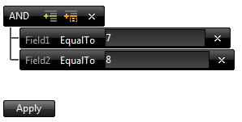

# Getting Started

This help topic describes the main features of the RadFilter control and how it can be used.

## General information

**RadFilter** allows the developer to supply an interface for constructing strongly typed filter expressions.These expressions can subsequently be used to query data from a data source control, or be applied to a control, which supports such filter expressions, for example RadListView.

From a logical perspective, the control consists of a root filtering menu/group, which allows the following things:

1. Expression, where the user can enter the filter criteria.

1. Add a new filtering group. Each filtering group can in turn offer the same two options. Each filtering group can be removed, with the exception of the root.

Each filter group offers the option to select one of four key words: **And**, **Or**, **NotAnd**, **NotOr**. Each keyword is applied to the filter expressions within the respective group - be it a root group, or a nested group. For example, if the root group has an "And" option chosen, the filter expressions within this group will be concatenated via this option, in addition to the actual filter strings. The result of applying a number of filter expressions may look like this:

**([Field1] = '7' AND [Field2] = 8)**


Each filter expression allows the selection and manipulation of the following elements:

1. The field, which will be filtered, for example "Field1";

1. The filter option, which will be applied, for example "EqualTo";

1. The value,which will be matched in the filter expression;

1. The rightmost "cross" symbol is used to remove the respective filter expression.

In addition to the filtering groups, the filter control renders an "Apply" button, which is used to trigger the actual construction of the filtering menu, once the user has made the necessary selections.

>tip Most of the RadFilter control functionalities require that the ViewState is enabled - both for the control, and any container controls, in order for the operations to be handled properly and the filter expressions persisted.
>


## Using the FilterContainerID property

There are cases when the filter expressions of the RadFilter control can be directly correlated to a data bound control such as the RadListView. To do so, you can set the FilterContainerID property to the ID of the control whose data will reflect the filter expression built via RadFilter. The code for this example is below:

````ASPNET
<telerik:RadFilter RenderMode="Lightweight" runat="server" ID="RadFilter1" Skin="Black" FilterContainerID="RadListView1">
</telerik:RadFilter>
````


Essentially, after constructing the filter expression and clicking the "Apply" button, the container control will be bound to the data reflecting the filter expression.

It is important to note that if there are any field editors defined in the ASPX code, they will be overridden by the autogenerated from the data field editors.

The FilterContainerID can be set to point to containers which implement the IRadFilterableContainer interface. Presently, the RadListView and the RadGrid controls do this. For other controls, one can omit this setting and use the constructed filter expression directly as it is explained [here]().

## Using the DataSourceControlID property

The RadFilter can filter .NET 3.5/.NET 4 data source controls directly. You only need to specify the DataSourceControlID property. Then, after constructing the filter expression and clicking the "Apply" button, the expression will be applied to the data source control.

Similar to Using the FilterContainerID property, all field editors defined in the ASPX code, will be overridden by the autogenerated from the data field editors.

For a example of the integration between RadFilter and .NET 3.5/4.0 DataSourceControls, please examine the [Filtering DataSourceControl with RadFilter](http://demos.telerik.com/aspnet-ajax/filter/examples/datasourceintegration/defaultcs.aspx) demo.
