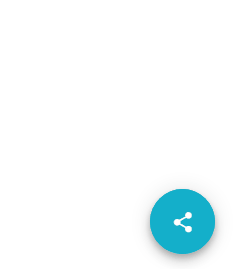

# Items

RadFloatingActionButton exposes speed-dial items that will be rendered in a popup container anchored to the FloatingActionButton itself.

When Items are defined, clicking on the FloatingActionButton will open the popup containing the speed-dial list.


The speed-dial items can be declared in the dedicated `Items` inner tag:

````ASPX
<telerik:RadFloatingActionButton runat="server" ID="FabSpeedDial" Icon="cog" PositionMode="Absolute">
    <Items>
        <telerik:FloatingActionButtonItem Label="Save" Icon="save" />
        <telerik:FloatingActionButtonItem Label="Share" Icon="share"/>
    </Items>
</telerik:RadFloatingActionButton>
````

Each Item exposes the following properties:

 - `Label` - sets the text of the item
 - `Icon` - sets the name of a built-in icon
 - `Enabled` - defines wether the item to be enabled or disabled
 - `Title` - sets tooltip for the item

Clicking on each of the speed-dial items can be easily handled on the client-side by specifying ClientClicked event listener via the `OnClientClicked` property.

## ClientTemplate

The RadFloatingActionButton provides full control over the rendering of the speed dial action items by using [Kendo UI templates](https://docs.telerik.com/kendo-ui/framework/templates/overview).



The `ClientTemplate` inner tag exposed in each Item allows managing the way the speed dial action items of a FloatingActionButton are rendered:

````ASPX
 <telerik:RadFloatingActionButton runat="server" Icon="share" PositionMode="Absolute" Align="BottomEnd" Size="Medium" ThemeColor="primary">
    <AlignOffsetSettings X="50" Y="50" />
    <ClientEvents OnExpand="OnExpand" OnCollapse="OnCollapse" />
    <Items>
        <telerik:FloatingActionButtonItem OnClientClicked="onItemClicked" Label="Darrel Sollis">
            <ClientTemplate>javascript:getTemplate({text: 'Share with Darrel Sollis',image: 'AROUT.jpg'})</ClientTemplate>
        </telerik:FloatingActionButtonItem>
        <telerik:FloatingActionButtonItem OnClientClicked="onItemClicked" Label="Mia Caldwell">
            <ClientTemplate>javascript:getTemplate({text: 'Share with Mia Caldwell',image: 'BSBEV.jpg'})</ClientTemplate>
        </telerik:FloatingActionButtonItem>
        <telerik:FloatingActionButtonItem OnClientClicked="onItemClicked" Label="Mallory Gillian">
            <ClientTemplate>javascript:getTemplate({text: 'Share with Mallory Gillian',image: 'FISSA.jpg'})</ClientTemplate>
        </telerik:FloatingActionButtonItem>
    </Items>
</telerik:RadFloatingActionButton>

<script id="fabItemTemplate" type="text/x-kendo-template">
    <span class="k-fab-item-text">#:text#</span>
    <span class="k-avatar k-avatar-solid-primary k-avatar-solid k-rounded-full k-avatar-md">
        <span class="avatar-image">
            
        </span>
    </span>
</script>
````

Test the complete example in our live demo on customizing the [FloatingActionButton Templates](https://demos.telerik.com/aspnet-ajax/floatingactionbutton/templates/defaultcs.aspx).

# See Also

 * [FloatingActionButton Templates demo](https://demos.telerik.com/aspnet-ajax/floatingactionbutton/templates/defaultcs.aspx)
 * [Kendo UI templates](https://docs.telerik.com/kendo-ui/framework/templates/overview)

