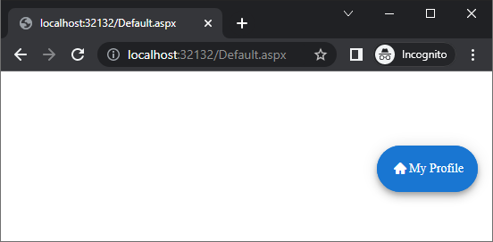

# Getting Started with the FloatingActionButton

The following article demonstrates how you can add the RadFloatingActionButton control and customize it by setting some of its properties.




## Add a RadFloatingActionButton Control

To add a RadFloatingActionButton similar to the one shown in image above, follow the steps:

 - Add a `ScriptManager` control on a Web Form.

 - Use the `<telerik:RadFloatingActionButton>` tag to declare the FloatingActionButton.

 - Use the exposed control properties and the available inner tags to set the desired control structure fine-tune its appearance:

You can set the desired button text via the `Text` property and specify a built-in icon via the `Icon` property.

````ASPX
<telerik:RadFloatingActionButton runat="server" Icon="home" Align="BottomEnd" Text="My Profile" PositionMode="Absolute">
    <AlignOffsetSettings Y="55" />
</telerik:RadFloatingActionButton>
````

As a next step, you can check out the [Functionality]() of the FloatingActionButton.

## See Also

 * [Functionality]()
 * [RadFloatingActionButton online demos](https://demos.telerik.com/aspnet-ajax/floatingactionbutton/examples/overview/defaultcs.aspx)


