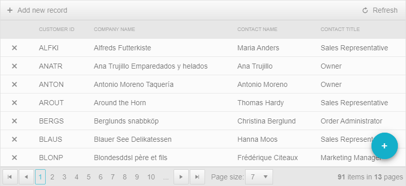
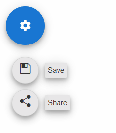

# WebForms FloatingActionButton Overview

The Telerik RadFloatingActionButton is a component tied to the primary action of a screen. It floats in the application above other items and has some main action that is contextual to the content on the page.

RadFloatingActionButton is available as of R3 2022 and it is a server-side WebForms wrapper over the [Kendo UI FloatingActionButton for jQuery](https://docs.telerik.com/kendo-ui/controls/navigation/floatingactionbutton/overview) widget.

## Key Features

* [Built-in accessibility, WAI-ARIA and RTL support]()
* [Flexible positioning and alignment]()
* [Items]()
* [Support for ClientItemTemplate](#clienttemplate)
* [Flexible client-side API]()
* [Visual Appeal - shipped with a rich set of skins for easy and consistent styling](#skins)

## Skins

The RadFloatingActionButton control can be styled by setting a desired built-in skin:

Find more information about using skins in the [Controlling Visual Appearance]() section.

Go ahead with the [Getting Started]() article to learn more about RadFloatingActionButton Control. Also, you can check out the [RadFloatingActionButton online demos](https://demos.telerik.com/aspnet-ajax/floatingactionbutton) to see it in action.

# See Also

 * [Getting Started]()
 * [RadFloatingActionButton online demos](https://demos.telerik.com/aspnet-ajax/floatingactionbutton/examples/overview/defaultcs.aspx) 
 * [ASP.NET AJAX Floating Action Button](https://www.telerik.com/products/aspnet-ajax/floating-action-button.aspx)
 * [Install Telerik UI for ASP.NET AJAX with MSI installer]() 

