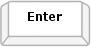
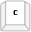
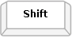

# Keyboard Support

Form elements styled by **RadFormDecorator** provide the same set of keyboard navigation shortcuts that you usually get from the standard, unmodified elements by the browser.

Most of the skinned HTML elements like check boxes and buttons have a limited, well known selection of keyboard shortcuts. The select element, however, offers a longer list in order to allow you to show/hide the drop-down and select elements from its list easily via the keyboard and to navigate through the list items.

Below you can find the options for keyboard navigation that are supported by the decorated select element:

### Opening and closing the drop-down list

| Operation | Keyboard Shortcut |  |
| ------ | ------ | ------ |
|Open/close the drop-down list.| **Alt + Up/Down arrow** |+|
|Close the drop-down list.| **Enter** or **Escape** | *or*  |

### Navigating the list

| Operation | Keyboard Shortcut |  |
| ------ | ------ | ------ |
|Select the previous/next element from the list.| **Up/Down arrow** ||
|Select the first item that starts with the typed letter sequence.| **Keyboard letters** ||

### Using multiple selection list

| Operation | Keyboard Shortcut |  |
| ------ | ------ | ------ |
|Put the previous/next element in active state.| **Ctrl + Up/Down arrow** |+|
|Toggle the active element between selected and unselected state.| **Space** or **Ctrl + Space** | *or* +|
|Toggle the selected state of the elements in the selected direction.| **Shift + Up/Down arrow** |+|
|Put the active item in selected state.| **Enter** ||

# See Also

 * [RadFormDecorator Overview Demo](http://demos.telerik.com/aspnet-ajax/formdecorator/examples/overview/defaultcs.aspx)
