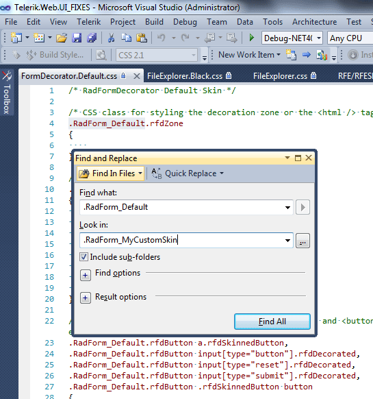
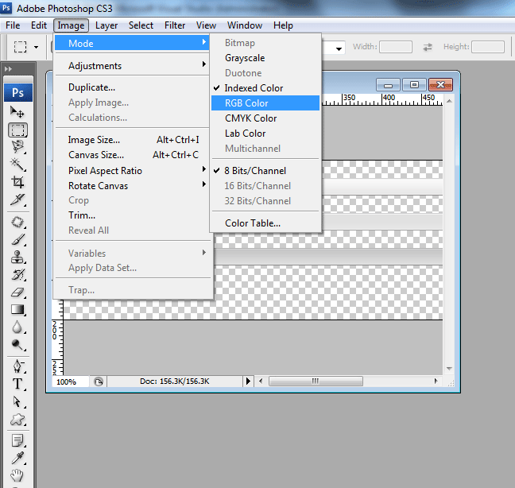
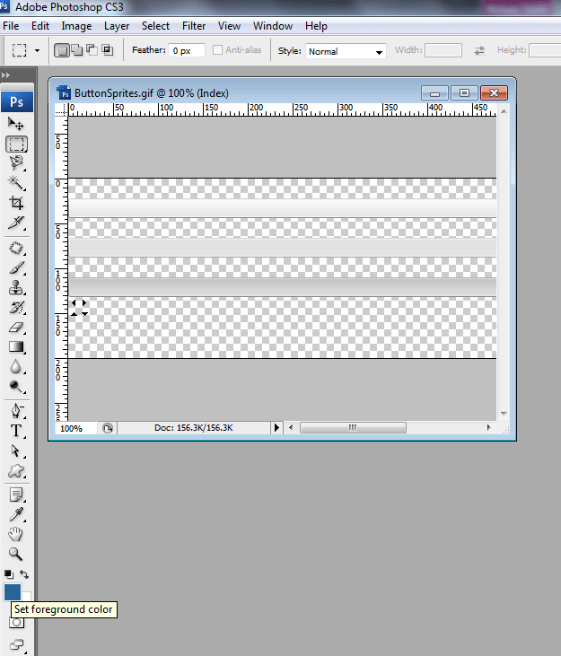
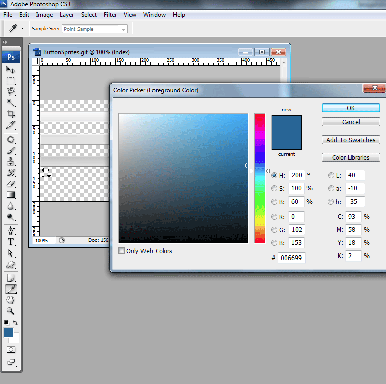
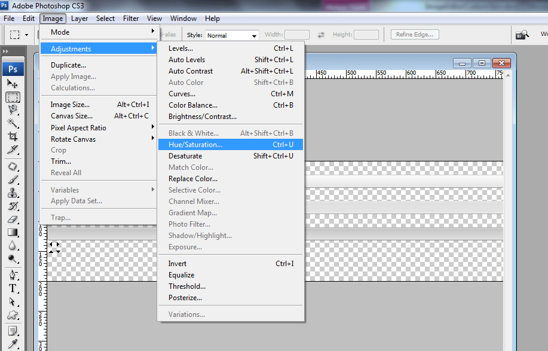
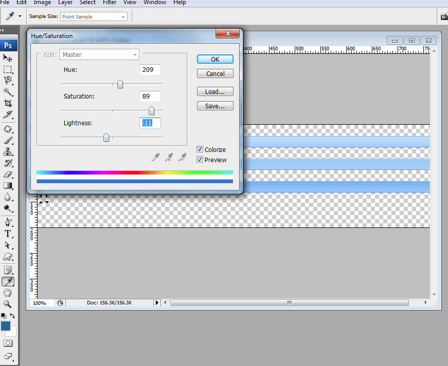

# Tutorial: Creating a Custom Skin

Each of the controls included in the **Telerik® UI for ASP.NET AJAX** suite is styled with two CSS files that are loaded in a certain order. The first one - **ControlName.css** , also called base stylesheet contains CSS properties and values that are common for all skins, i.e it is layout-specific, not skin-specific. These are CSS float, padding, margin, font-size, font-family, etc. In the general case, when creating a custom skin for a control this file should not be edited, unless the custom skin needs different sizes, padding and/ or margins. 

The second file represents the actual skin of the control, and its name consists of the control name plus the skin name, i.e - **FormDecorator.Default.css**. Upon creating a custom skin for the control, one should edit that particular file, as it contains skin-specific CSS properties, and references to images, colors, borders and backgrounds.

## Creating Custom Skin for RadFormDecorator from an Existing One

In order to explain better the CSS classes of RadToolTip, we will use ToolTip.SkinName.css as external resources. We will modify an existing skin of RadToolTip. Follow these steps to register an external skin for RadToolTip for ASP.NET AJAX before editing any CSS:

1. In your project, create a new directory named **Skins**

1. In the **Skins** folder create a new directory **MyCustomSkin**. 

1. Go to **~/[TelerikControlsInstallationFolder]/Skins/Default** and copy **FormDecorator.Default.css** and the **Skins/Default/FormDecorator** folder in your Skins folder. 

1. Rename **FormDecorator.Default.css** to **FormDecorator.MyCustomSkin.css** and the folder **Default** to **MyCustomSkin**. 

1. When you are finished you should have **Skins/MyCustomSkin/FormDecorator.MyCustomSkin.css** and **Skins/MyCustomSkin/FormDecorator**. The last folder contains the images for **MyCustomSkin**. 

1. In order to support multiple skins of **RadFormDecorator** on a single page, the wrapping skin-specific class is coined by the name of the control, RadFormDecorator plus underscore ("`_`") plus SkinName, i.e. **.RadFormDecorator_Default**, so in order to create a custom skin out of the Default skin, we should rename all occurrences of "**Default**" in **FormDecorator.MyCustomSkin.css** to "**MyCustomSkin**" as shown below:

	

1. Add a new server declaration of RadFormDecorator on your page, and set Skin="MyCustomSkin" and EnableEmbeddedSkins="false":

	__ASP.NET__

		<telerik:RadFormDecorator RenderMode="Lightweight" ID="rfd1" runat="server" DecoratedControls="All" EnableEmbeddedSkins="false" Skin="MyCustomSkin" />

1. Register FormDecorator.MyCustomSkin.css in the `<head>...</head>` section of your webpage. In order to have the CSS applied correctly, the base stylesheet should come first in the DOM:

	__HTML__

		<link href="Skins/MyCustomSkin/FormDecorator.MyCustomSkin.css" rel="stylesheet" type="text/css" />

1. Make sure the path to the files is correct, otherwise the skin will not apply.

1. Reload the page, and if the steps 1-9 have been followed correctly, you will see **RadFormDecorator** running a custom Default skin set as an external resource.

## Modifying the Image Sprites to Achieve Totally New Looks for the Skin

Each skin of **RadFormDecorator** consists of several image sprites contained in the **Skins/_SkinName_/FormDecorator** folder:

* **ButtonSprites.gif** contains buttons and scrollbar arrows 

* **CheckBoxSprites.gif** contains all checkbox states 

* **RadioButtonSprites.png** contains all radio button states 

* **RadioButtonSprites.gif** contains all radio button states for IE6 

* **ComboSprites.gif** contains the dropdown/select states 

* **FieldsetBgr.png** contains the fieldset background

Explained below is a simple method for modifying the image sprites of **RadFormDecorator** with Adobe© PhotoShop to achieve new looks without creating a new design.

1. Drag **ButtonSprites.gif** in Adobe© PhotoShop.

1. From the menu bar select Image » Mode » RGB Color to prepare the images for editing (convert from optimized Indexed Color to RGB Color):

	

1. Press Set Foreground Color in PhotoShop's toolbox to invoke the color picker dialog:

	

1. Select a color that you like from the color dialog and then close it:

	

1. Choose the image you will modify - **ButtonSprites.gif**, and select Image » Adjustments » Hue/Saturation to open the Hue/Saturation dialogof Adobe© PhotoShop:

	

1. Check the colorize checkbox in the Hue / Saturation dialog, and the image you have selected will be immediately colorized in the hue you have selected from the toolbox:

	

	You may then play with the Hue, Saturation and Lightness sliders to fine tune or further modify the image.

1. Press "OK" when you are finished

1. Select Image Image » Mode » Indexed Color to flatten the layers of the image

1. Save and close the image

1. Once you are ready, save your work and reload the page. You will have a brand new skin based on Telerik's Default skin of **RadFormDecorator**.

# See Also

* [RadFormDecorator's CSS Classes]()

* [Skinning - Deep Dive for the Telerik® UI for ASP.NET AJAX](https://www.telerik.com/videos)

* [Visual Style Builder for ASP.NET](https://www.telerik.com/products/aspnet-ajax/visual-style-builder.aspx)
