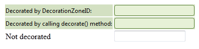

# Client-side Programming Overview

|  **Name**  |  **Description**  |
| ------ | ------ |
| **decorate(element)** | The argument of the method is the DOM element whose children will be decorated; If the method is called with an argument and DecorationZoneID is set, both zones (the one related to the argument and the other related to the DecorationZoneID) will be decorated; Calling the method without an argument forces decoration of the entire page.|

````JavaScript
<script type="text/javascript">
	function pageLoad() {
		var rfd1 = $find('<%=RadFormDecorator1.ClientID %>');
		var decorated = document.getElementById("tr2");
		rfd1.decorate(decorated);
	}
</script>
````

````ASP.NET
<telerik:RadFormDecorator RenderMode="Lightweight" ID="RadFormDecorator1" runat="server" DecoratedControls="All" Skin="Forest"
	EnableRoundedCorners="True" DecorationZoneID="tr1" />
<table>
	<tr id="tr1">
		<td>
			<label>
				Decorated by DecorationZoneID:</label>
		</td>
		<td>
			<input type="text" id="input1" value="" />
		</td>
	</tr>
	<tr id="tr2">
		<td>
			<label>
				Decorated by calling decorate() method:</label>
		</td>
		<td>
			<input type="text" id="Text2" value="" />
		</td>
	</tr>
	<tr id="tr3">
		<td>
			<label>
				Not decorated</label>
		</td>
		<td>
			<input type="text" id="Text3" value="" />
		</td>
	</tr>
</table>
````


