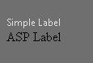
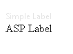

# What is Zone

**RadFormDecorator** can style the empty area on the page that has no controls but empty space or generic HTML tags like spans or divs - color and background color are applied. This special area is called **"Zone"** and developers can have control over it (set whether it will be decorated or not) through **DecoratedControls** and **ControlsToSkip** properties of the FormDecorator.

There are a couple of Skins (**Black**, **BlackMetroTouch**, **Glow**, **Office2010Black** and **Office2010Silver**) which can decorate the **"Zone"** by applying background-color, and color. The following example shows full decoration on the page (the Label element and the Zone) with the "Office2010Black" Skin:

````ASP.NET
<telerik:RadFormDecorator RenderMode="Lightweight" runat="server" ID="rfd1" Skin="Office2010Black" DecoratedControls="All" />
<br />
<br />
<label>
	Simple Label</label>
<br />
<asp:Label runat="server">ASP Label</asp:Label>
````



The following example shows decoration only on the simple Label element (Zone is excluded from decoration) with the "Office2010Black" Skin:

````ASP.NET
<telerik:RadFormDecorator RenderMode="Lightweight" runat="server" ID="RadFormDecorator1" Skin="Office2010Black" DecoratedControls="All"
	ControlsToSkip="Zone" />
<br />
<br />
<label>
	Simple Label</label>
<br />
<asp:Label ID="Label1" runat="server">ASP Label</asp:Label>
````



>note In both examples only the HTML Label is decorated, as the ASP Label is not rendered as a Label but a span element.

