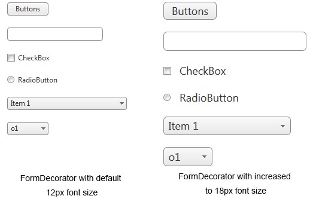

# Responsive, Adaptive and Elastic Capabilities

This article explains the **responsive design capabilities RadFormDecorator offers**.	The [Lightweight RenderMode]() of RadFormDecorator supports	**elastic design since Q2 2013**.

Generally, responsive design means that the page and its content are able to adapt to different screen resolutions without deteriorating	the user experience. This often includes changing the font size and having dimensions set in percent.

## Elastic Design with RadFormDecorator

>caption **Figure 1**: Comparison between appearance of a RadFormDecorator with regular font size and with increased font size



**RadFormDecorator** can be used to create elastic design for the controls placed in a page that follows this pattern, **changing their font size**.This means that RadFormDecorator's **Lightweight RenderMode** supports changing	the font size without breaking the decorated control's appearance. If the new size set to the decorated elements is larger than the original one,the elements in the controls will simply increase their size as well to accommodate the text. This fluid layout is achieved by using `em` units for setting dimensions and paddings in the control, instead of `px`because `em` units are tied to the font size. This allows dimensions and sizes to scale with the font size.

Elements that use images or images sprites, however, cannot be increased in size, so the icons will keep having their original dimensions and position.

**Example 1** shows how to increase the font size of the elements on the page with RadFormDecorator and the effect can be seen in comparison in **Figure 1**. RadFormDecorator should have a specific approach as its root element is set to the HTML element and giving some specific font size could change some parts that are not part of RadFormDecorator. So, we will need to group the RadFormDecorator elements that should be increased:

When using a [Decoration Zone](http://demos.telerik.com/aspnet-ajax/formdecorator/examples/decorationzoneid/defaultcs.aspx), you should cascade the selectors through that zone to make them heavier, as shown in **Example 2**.

>caption **Example 1**: CSS selectors for using elastic design with RadFormDecorator.

````ASP.NET
<style type="text/css">
/* FormDecorator */
html.RadForm .rfdSkinnedButton,
html.RadForm .rfdTextInput,
html.RadForm.rfdLabel label,
html.RadForm.rfdLabel .rfdAspLabel,
html.RadForm.rfdTextbox input,
html.RadForm.rfdTextarea textarea,
html.RadForm.rfdFieldset fieldset,
html.RadForm.rfdFieldset legend,
html.RadForm .rfdSelect,
html.RadForm.rfdHeading h4,
html.RadForm.rfdHeading h5,
html.RadForm.rfdHeading h6,
html.RadForm .riTextBox,
html.RadForm .rfdValidationSummaryControl,
html.RadForm .rfdLoginControl {
	font-size: 18px;
}

/* Headings */
html.RadForm.rfdHeading h4 {
	font-size: 40px;
}
html.RadForm.rfdHeading h5 {
	font-size: 35px;
}
html.RadForm.rfdHeading h6 {
	font-size: 30px;
}

/* ListBox Styles */
html.rfdSelectBox {
	font-size: 18px;
}

/* drop down arrow positions should be tweaked */
html.RadForm .rfdDropDownArrow
{
	right: 5px;
	top: 5px;
}

/* checkboxes and radio buttons' positions should be tweaked */
html.RadForm .rfdCheckboxChecked .rfdToggleImage,
html.RadForm .rfdCheckboxUnchecked .rfdToggleImage,
html.RadForm .rfdRadioChecked .rfdToggleImage,
html.RadForm .rfdRadioUnchecked .rfdToggleImage
{
	top: 7px;
}
</style>
<telerik:RadFormDecorator ID="RadFormDecorator1" runat="server" DecoratedControls="all" RenderMode="Lightweight"/>
<asp:Button ID="Button1" runat="server" Text="Buttons" /><br /><br />
<asp:TextBox ID="TextBox1" runat="server"></asp:TextBox><br /><br />
<asp:CheckBox ID="CheckBox1" runat="server" Text="CheckBox" /><br /><br />
<asp:RadioButton ID="RadioButton1" runat="server" Text="RadioButton" /><br /><br />
<asp:DropDownList ID="DropDownList1" runat="server" Width="200">
	<asp:ListItem Text="Item 1"></asp:ListItem>
	<asp:ListItem Text="Item 2"></asp:ListItem>
	<asp:ListItem Text="Item 3"></asp:ListItem>
	<asp:ListItem Text="Item 4"></asp:ListItem>
</asp:DropDownList><br /><br />
<select id="Select1">
	<option value="v1">o1</option>
	<option value="v2">o2</option>
	<option value="v3">o3</option>
	<option value="v4">o4</option>
</select>
````

>caption **Example 2**: CSS selectors for using elastic design with RadFormDecorator and a Decoration Zone.

````ASP.NET
<style type="text/css">
/* FormDecorator */
.someClass.RadForm .rfdSkinnedButton,
.someClass.RadForm .rfdTextInput,
.someClass.RadForm.rfdLabel label,
.someClass.RadForm.rfdLabel .rfdAspLabel,
.someClass.RadForm.rfdTextbox input,
.someClass.RadForm.rfdTextarea textarea,
.someClass.RadForm.rfdFieldset fieldset,
.someClass.RadForm.rfdFieldset legend,
.someClass.RadForm .rfdSelect,
.someClass.RadForm.rfdHeading h4,
.someClass.RadForm.rfdHeading h5,
.someClass.RadForm.rfdHeading h6,
.someClass.RadForm .riTextBox,
.someClass.RadForm .rfdValidationSummaryControl,
.someClass.RadForm .rfdLoginControl {
	font-size: 18px;
}

/* Headings */
.someClass.RadForm.rfdHeading h4 {
	font-size: 40px;
}
.someClass.RadForm.rfdHeading h5 {
	font-size: 35px;
}
.someClass.RadForm.rfdHeading h6 {
	font-size: 30px;
}

/* ListBox Styles */
.someClass.rfdSelectBox {
	font-size: 18px;
}

/* drop down arrow positions should be tweaked */
.someClass.RadForm .rfdDropDownArrow
{
	right: 5px;
	top: 5px;
}

/* checkboxes and radio buttons' positions should be tweaked */
.someClass.RadForm .rfdCheckboxChecked .rfdToggleImage,
.someClass.RadForm .rfdCheckboxUnchecked .rfdToggleImage,
.someClass.RadForm .rfdRadioChecked .rfdToggleImage,
.someClass.RadForm .rfdRadioUnchecked .rfdToggleImage
{
	top: 7px;
}
</style>
<telerik:RadFormDecorator ID="RadFormDecorator2" runat="server" DecoratedControls="all" RenderMode="Lightweight" DecorationZoneID="theDecorationZone" />
Elements outside of this div will not be affected
<div class="someClass" id="theDecorationZone">
	<asp:Button ID="Button2" runat="server" Text="Buttons" /><br />
	<br />
	<asp:TextBox ID="TextBox2" runat="server"></asp:TextBox><br />
	<br />
	<asp:CheckBox ID="CheckBox2" runat="server" Text="CheckBox" /><br />
	<br />
	<asp:RadioButton ID="RadioButton2" runat="server" Text="RadioButton" /><br />
	<br />
	<asp:DropDownList ID="DropDownList2" runat="server" Width="200">
		<asp:ListItem Text="Item 1"></asp:ListItem>
		<asp:ListItem Text="Item 2"></asp:ListItem>
		<asp:ListItem Text="Item 3"></asp:ListItem>
		<asp:ListItem Text="Item 4"></asp:ListItem>
	</asp:DropDownList><br />
	<br />
	<select id="Select2">
		<option value="v1">o1</option>
		<option value="v2">o2</option>
		<option value="v3">o3</option>
		<option value="v4">o4</option>
	</select>
</div>
````

# See Also

 * [Render Modes]()
