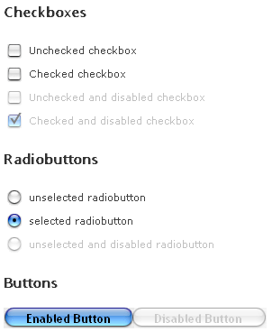

# FormDecorator Overview

**RadFormDecorator** is part of Telerik UI for ASP.NET AJAX Suite that enables CSS skinning of:

* Buttons

* CheckBoxes

* Fieldset (including *legend* tags)

* GridFormDetailsViews

* H4,H5,H6

* Label

* RadioButtons

* Scrollbars

* Textarea

* Textbox

* SELECT (dropdowns and listboxes)

elements, without generating any additional Html - hidden inputs, divs, etc. Thus it integrates seamlessly into the page and doesn't require any changes to the existing page's layout.

Here are the main features of the control:

* Hover/Out states for the buttons using pure CSS

* Caching of images for IE6 (smoother user experience)

* CSS for disabled radiobuttons, checkboxes and buttons

* Various CSS look & feel improvements

* Right to left support

>note The **Hay** , **Forest** , **Sitefinity** and **Transparent** skins are obsolete and have been removed from the Telerik.Web.UI.Skins.dll assembly as of **Q1 2014** .	You can find more information on the matter in [this blog post](http://blogs.telerik.com/aspnet-ajax/posts/13-04-11/6-telerik-asp.net-ajax-skins-going-obsolete).

To decorate the form elements on a webpage:

1. Register **Telerik.Web.UI** namespace tagprefix:

	**ASP.NET**
		
		<%@ Register TagPrefix="telerik" Namespace="Telerik.Web.UI" Assembly="Telerik.Web.UI" %>

1. Add the **RadFormDecorator** server tag on the webpage:

	**ASP.NET**
		
		<telerik:RadFormdecorator id="FormDecorator1" runat="server" DecoratedControls="all" Skin="Web20"></telerik:RadFormdecorator>

Values of the **DecoratedControls** property are:

* All

* Buttons

* CheckBoxes

* Default

* Fieldset

* H4H5H6

* Label

* None

* RadioButtons

* Select

* Scrollbars

* Textarea

* Textbox

The **Default** value enables the decoration of the following elements: Buttons, CheckBoxes, RadioButtons and Scrollbars.

The **ControlsToSkip** property allows you to exclude certain controls from decoration set with the **DecoratedControls** property. For example: **DecoratedControls="All" ControlsToSkip="H4H5H6"**.

