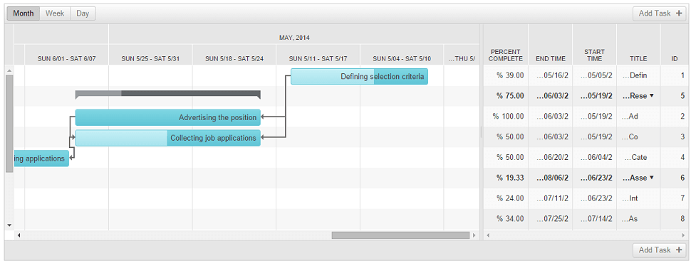

# RTL Support

## 

**RadGantt** supports right-to-left direction using the direction attribute. You can enable this functionality by setting the control's **dir** attribute to **"rtl"**:

````ASP.NET
<telerik:RadGantt runat="server" ID="RadGantt1"
    dir="rtl"
    AutoGenerateColumns="true"
    SelectedView="MonthView"
    Skin="Silk">
</telerik:RadGantt>
````

This results in the following **RadGantt** appearance:



For a live example, see [Right to Left Support Demo](http://demos.telerik.com/aspnet-ajax/gantt/examples/accessibility-and-internationalization/right-to-left-support/defaultcs.aspx?isNew=true)
