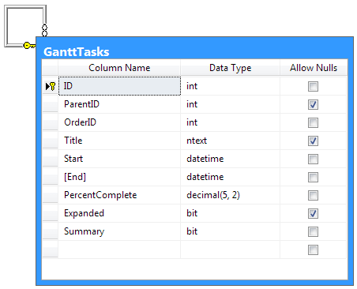
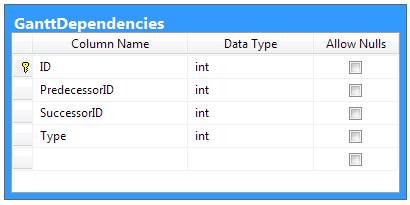

# Database Structure

The **Gantt**'s data can be stored within a Database with tables for the [Tasks]() and[Dependencies](). Below is shown a sample database with all required fields.

## Tasks

You can use the following script to add the Gantt's Tasks table to an existing database:

````XML	
USE [DBNAME]
GO

--CREATE TASKS TABLE
SET ANSI_NULLS ON
GO
SET QUOTED_IDENTIFIER ON
GO
CREATE TABLE [dbo].[GanttTasks](
	[ID] [int] IDENTITY(1,1) NOT NULL,
	[ParentID] [int] NULL,
	[OrderID] [int] NOT NULL,
	[Title] [ntext] NULL,
	[Start] [datetime] NOT NULL,
	[End] [datetime] NOT NULL,
	[PercentComplete] [decimal](5, 2) NOT NULL,
	[Expanded] [bit] NULL,
	[Summary] [bit] NOT NULL,
 CONSTRAINT [PK_GanttTasks] PRIMARY KEY CLUSTERED 
(
	[ID] ASC
)WITH (PAD_INDEX = OFF, STATISTICS_NORECOMPUTE = OFF, IGNORE_DUP_KEY = OFF, ALLOW_ROW_LOCKS = ON, ALLOW_PAGE_LOCKS = ON) ON [PRIMARY]
) ON [PRIMARY] TEXTIMAGE_ON [PRIMARY]

SET IDENTITY_INSERT [dbo].[GanttTasks] OFF
ALTER TABLE [dbo].[GanttTasks] ADD  CONSTRAINT [DF_GanttTasks_Summary]  DEFAULT ((0)) FOR [Summary]
GO
ALTER TABLE [dbo].[GanttTasks]  WITH CHECK ADD  CONSTRAINT [FK_GanttTasks_GanttTasks] FOREIGN KEY([ParentID])
REFERENCES [dbo].[GanttTasks] ([ID])
GO
ALTER TABLE [dbo].[GanttTasks] CHECK CONSTRAINT [FK_GanttTasks_GanttTasks]
GO
````

## Dependencies

Here is a simpler example without support for resources:

````XML
--CREATE DEPENDENCIES TABLE
SET ANSI_NULLS ON
GO
SET QUOTED_IDENTIFIER ON
GO
CREATE TABLE [dbo].[GanttDependencies](
	[ID] [int] IDENTITY(1,1) NOT NULL,
	[PredecessorID] [int] NOT NULL,
	[SuccessorID] [int] NOT NULL,
	[Type] [int] NOT NULL,
 CONSTRAINT [PK_GanttDependencies] PRIMARY KEY CLUSTERED 
(
	[ID] ASC
)WITH (PAD_INDEX = OFF, STATISTICS_NORECOMPUTE = OFF, IGNORE_DUP_KEY = OFF, ALLOW_ROW_LOCKS = ON, ALLOW_PAGE_LOCKS = ON) ON [PRIMARY]
) ON [PRIMARY]

GO
SET IDENTITY_INSERT [dbo].[GanttDependencies] ON 
````


# See Also

 * [Tasks]()

 * [Dependencies]()
