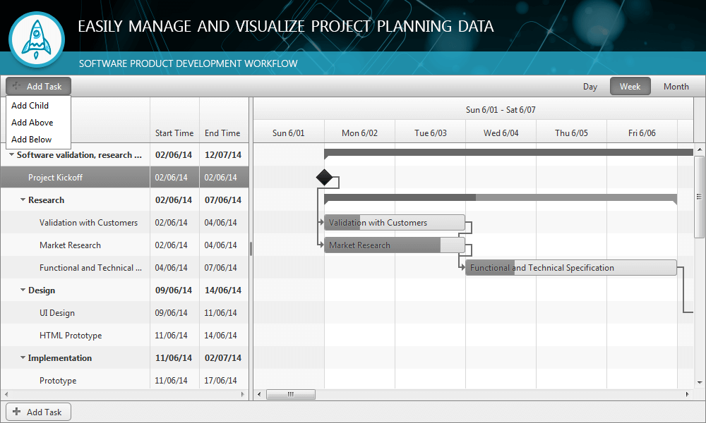

# Adding Tasks

This help article demonstrates how to add a new task in **RadGantt** tree.

## 

To add a task you need to click the **Add Task** button which could be located either at the top or at the bottom of the **TreeList** area. If you didn't select a task before you click the button, then a new task will be added on the last possition of the tree. Otherwise if you select an item and then click the **Add Task** button a menu with three options will appear and you could choose where to add the new task. The first option is to add the task above the selected one, the second option is to add it below the selected one and the last option is to add the new task as a child of the selected one.

The image below shows the menu which appears when click the button to add a task.

# See Also

 * [Tasks]()
