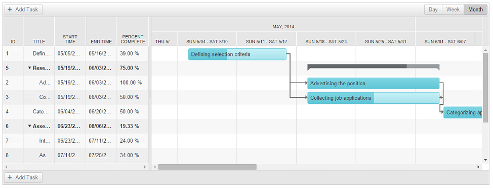
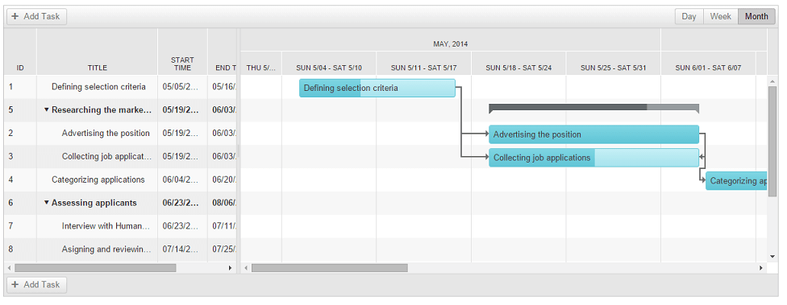

# Column Resizing

## 

**RadGantt** allows column resizing. This feature can be enabled/disabled by setting the control's **AllowColumnResize** property to **"true"/"false"**. To resize a column click and drag a line separating two columns in the TreeList view. 

````ASP.NET
<telerik:RadGantt RenderMode="Lightweight" runat="server" ID="RadGantt1"
    AllowColumnResize="true"
    AutoGenerateColumns="true"
    SelectedView="MonthView"
    Skin="Silk">
</telerik:RadGantt>
````

The following screenshots show the "Title" column before and after resizing:




For a live example, see [Resizing Columns Demo](https://demos.telerik.com/aspnet-ajax/gantt/examples/functionality/resizing-columns/defaultcs.aspx?isNew=true)
