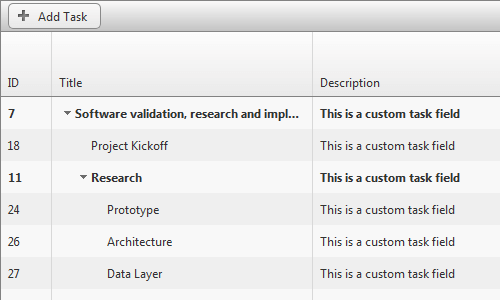

# Custom Tasks Fields


With the 2014 Q2 SP1 version you can now use __Custom Task__ objects to populate the __Gantt__,providing you with the ability to add user defined Properties to be shown in the control. In order to use a custom Task class you haveto create a custom Provider, like the one shown in [this help article](). Sample Code Library can be downloaded from [ here ]( http://www.telerik.com/support/code-library/gantt-custom-columns ).

## Adding custom fields to Task with custom Entity provider

1. Use previous help article to set up custom Entity Provider

1. Create Custom Task class, inheriting from __Task__.

>tabbedCode

````C#
	    public class CustomTask : Task
	    {
	        public CustomTask()
	            : base()
	        {
	        }
	    }
````
````VB.NET
	    Public Class CustomTask
	        Inherits Task
	        Public Sub New()
	            MyBase.New()
	        End Sub
	    End Class
````
>end

1. Add custom property

>tabbedCode

````C#
	    public class CustomTask : Task
	    {
	        ...
	        public string Description
	        {
	            get { return (string)(ViewState["Description"] ?? ""); }
	            set { ViewState["Description"] = value; }
	        }
	    }
````
````VB.NET
	    Public Class CustomTask
	        Inherits Task
	        ...
	        Public Property Description() As String
	            Get
	                Return DirectCast(If(ViewState("Description"), ""), String)
	            End Get
	            Set(value As String)
	                ViewState("Description") = value
	            End Set
	        End Property
	    End Class
````
>end

1. Override __GetSerializationData__ and __LoadFromDictionary__ methods

>tabbedCode

````C#
	    public class CustomTask : Task
	    {
	        ...
	        protected override IDictionary<string, object> GetSerialzationData()
	        {
	            var dict = base.GetSerialzationData();
	
	            dict["Description"] = Description;
	
	            return dict;
	        }
	
	        public override void LoadFromDictionary(System.Collections.IDictionary values)
	        {
	            base.LoadFromDictionary(values);
	
	            Description = (string)values["Description"];
	        }
	    }
````
````VB.NET
	    Public Class CustomTask
	        Inherits Task
	        ...
	        Protected Overrides Function GetSerialzationData() As IDictionary(Of String, Object)
	            Dim dict = MyBase.GetSerialzationData()
	
	            dict("Description") = Description
	
	            Return dict
	        End Function
	
	        Public Overrides Sub LoadFromDictionary(values As System.Collections.IDictionary)
	            MyBase.LoadFromDictionary(values)
	
	            Description = DirectCast(values("Description"), String)
	        End Sub
	    End Class
````
>end

1. Create new __TaskFactory__

>tabbedCode

````C#
	    public class CustomGanttTaskFactory : ITaskFactory
	    {
	        Task ITaskFactory.CreateTask()
	        {
	            return new CustomTask();
	        }
	    }
````
````VB.NET
	    Public Class CustomGanttTaskFactory
	        Implements ITaskFactory
	        Private Function ITaskFactory_CreateTask() As Task Implements ITaskFactory.CreateTask
	            Return New CustomTask()
	        End Function
	    End Class
````
>end

1. Override Provider __TaskFactory__ property to return new factory

>tabbedCode

````C#
	    public class GanttCustomProvider : GanttProviderBase
	    {
	        public override ITaskFactory TaskFactory
	        {
	            get
	            {
	                return new CustomGanttTaskFactory();
	            }
	        }
	        ...
	    }
````
````VB.NET
	    Public Class GanttCustomProvider
	        Inherits GanttProviderBase
	        Public Overrides ReadOnly Property TaskFactory() As ITaskFactory
	            Get
	                Return New CustomGanttTaskFactory()
	            End Get
	        End Property
	    ...
	    End Class
	
````
>end

1. Update Provider __GetTasks__ Method

>tabbedCode

````C#
	    public override List<ITask> GetTasks()
	    {
	        var tasks = new List<ITask>();
	        using (var db = new GanttDatabaseEntities())
	        {
	            tasks.AddRange(db.GanttTasks.ToList().Select(task => new CustomTask
	            {
	                ID = task.ID,
	                ParentID = task.ParentID,
	                ...
	                Description = task.Description
	            }));
	        }
	        return tasks;
	    }
````
````VB.NET
	    Public Overrides Function GetTasks() As List(Of ITask)
	        Dim tasks = New List(Of ITask)()
	        Using db = New GanttDatabaseEntities()
	
			tasks.AddRange(db.GanttTasks.ToList().[Select](Function(task) New CustomTask() With { _
				Key .ID = task.ID, _
				Key .ParentID = task.ParentID, _
				...
				Key .Description = task.Description _
			}))
	        End Using
	        Return tasks
	    End Function
````
>end

1. Update Provider __ToEntityTask__ Method

>tabbedCode

````C#
	    private GanttTask ToEntityTask(ITask srcTask)
	    {
	        return new GanttTask
	            {
	                ID = (int)srcTask.ID,
	                ParentID = (int?)srcTask.ParentID,
	                ...
	                Description = ((CustomTask)srcTask).Description
	            };
	    }
````
````VB.NET
	    Private Function ToEntityTask(srcTask As ITask) As GanttTask
	
		Return New GanttTask() With { _
			Key .ID = CInt(srcTask.ID), _
			Key .ParentID = DirectCast(srcTask.ParentID, System.Nullable(Of Integer)), _
			...
			Key .Description = DirectCast(srcTask, CustomTask).Description _
		}
	    End Function
````
>end

## Defining Custom Tasks Fields

To add new __Custom Task Field__ you will have to:

1. Set the __AutoGenerateColumns__ property to __false__.

1. Define new __GanttBoundColumn__ in the __Columns collection__.

1. Define new __GanttCustomField__ in the __CustomTaskFields__ collection.

1. Defining Custom Columns:

* In the Markup:

````ASPNET
	<telerik:RadGantt runat="server" ID="RadGantt1" SelectedView="WeekView" AutoGenerateColumns="false">
	    <Columns>
	        <telerik:GanttBoundColumn DataField="ID" Width="90px"></telerik:GanttBoundColumn>
	        <telerik:GanttBoundColumn DataField="Title"></telerik:GanttBoundColumn>
	        <telerik:GanttBoundColumn DataField="Description" HeaderText="Description" DataType="String" UniqueName="Description">
	        </telerik:GanttBoundColumn>
	    </Columns>
	    <CustomTaskFields>
	        <telerik:GanttCustomField PropertyName="Description" ClientPropertyName="description"  Type="String" />
	    </CustomTaskFields>
	</telerik:RadGantt>
````


* In the Code Behind

>tabbedCode

````C#
	    protected void Page_Load(object sender, EventArgs e)
	    {
	        GanttCustomField customField = new GanttCustomField();
	        customField.Type = GanttCustomFieldType.String;
	        customField.PropertyName = "Description";
	        customField.ClientPropertyName = "description";
	        RadGantt1.CustomTaskFields.Add(customField);
	    }
````
````VB.NET
	    Protected Sub Page_Load(sender As Object, e As EventArgs) Handles Me.Load
	        Dim customField As New GanttCustomField()
	        customField.Type = GanttCustomFieldType.[String]
	        customField.PropertyName = "Description"
	        customField.ClientPropertyName = "description"
	        RadGantt1.CustomTaskFields.Add(customField)
	    End Sub
````
>end

# See Also

 * [Layout]()

 * [Tasks]()
