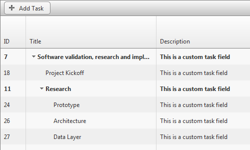

# Custom Tasks Fields


With the 2014 Q2 SP1 version you can now use **Custom Task** objects to populate the **Gantt**, providing you with the ability to add user defined Properties to be shown in the control. 

In order to use a custom Task class you have to create a custom Provider, like the one shown in the [Use CustomFields in Gantt with a simple CustomProvider](https://www.telerik.com/support/kb/aspnet-ajax/gantt/details/use-customfields-in-gantt-with-a-simple-customprovider) KB article or the [Custom EntityFramework Provider help article]() article. Sample Code Library can be downloaded from [here](https://www.telerik.com/support/code-library/gantt-custom-columns).



## Adding custom fields to Task with custom Entity provider

1. Use previous help article to set up custom Entity Provider

1. Create Custom Task class, inheriting from **Task**.

    **C#**
    
        public class CustomTask : Task
        {
            public CustomTask()
                : base()
            {
            }
        }


    **VB**
    
        Public Class CustomTask
            Inherits Task
            Public Sub New()
                MyBase.New()
            End Sub
        End Class

1. Add custom property

    **C#**
    
        public class CustomTask : Task
        {
            ...
            public string Description
            {
                get { return (string)(ViewState["Description"] ?? ""); }
                set { ViewState["Description"] = value; }
            }
        }


    **VB**
    
        Public Class CustomTask
            Inherits Task
            ...
            Public Property Description() As String
                Get
                    Return DirectCast(If(ViewState("Description"), ""), String)
                End Get
                Set(value As String)
                    ViewState("Description") = value
                End Set
            End Property
        End Class

1. Override **GetSerializationData** and **LoadFromDictionary** methods

    **C#**
    
        public class CustomTask : Task
        {
            ...
            protected override IDictionary<string, object> GetSerializationData()
            {
                var dict = base.GetSerializationData();
        
                dict["Description"] = Description;
        
                return dict;
            }
        
            public override void LoadFromDictionary(System.Collections.IDictionary values)
            {
                base.LoadFromDictionary(values);
        
                Description = (string)values["Description"];
            }
        }


    **VB**
    
        Public Class CustomTask
            Inherits Task
            ...
            Protected Overrides Function GetSerializationData() As IDictionary(Of String, Object)
                Dim dict = MyBase.GetSerializationData()
        
                dict("Description") = Description
        
                Return dict
            End Function
        
            Public Overrides Sub LoadFromDictionary(values As System.Collections.IDictionary)
                MyBase.LoadFromDictionary(values)
        
                Description = DirectCast(values("Description"), String)
            End Sub
        End Class

1. Create new **TaskFactory**

    **C#**
    
        public class CustomGanttTaskFactory : ITaskFactory
        {
            Task ITaskFactory.CreateTask()
            {
                return new CustomTask();
            }
        }


    **VB**
    
        Public Class CustomGanttTaskFactory
            Implements ITaskFactory
            Private Function ITaskFactory_CreateTask() As Task Implements ITaskFactory.CreateTask
                Return New CustomTask()
            End Function
        End Class

1. Override Provider **TaskFactory** property to return new factory

    **C#**
    
        public class GanttCustomProvider : GanttProviderBase
        {
            public override ITaskFactory TaskFactory
            {
                get
                {
                    return new CustomGanttTaskFactory();
                }
            }
            ...
        }


    **VB**
    
        Public Class GanttCustomProvider
            Inherits GanttProviderBase
            Public Overrides ReadOnly Property TaskFactory() As ITaskFactory
                Get
                    Return New CustomGanttTaskFactory()
                End Get
            End Property
        ...
        End Class

1. Update Provider **GetTasks** Method

    **C#**
    
        public override List<ITask> GetTasks()
        {
            var tasks = new List<ITask>();
            using (var db = new GanttDatabaseEntities())
            {
                tasks.AddRange(db.GanttTasks.ToList().Select(task => new CustomTask
                {
                    ID = task.ID,
                    ParentID = task.ParentID,
                    ...
                    Description = task.Description
                }));
            }
            return tasks;
        }


    **VB**
    
        Public Overrides Function GetTasks() As List(Of ITask)
            Dim tasks = New List(Of ITask)()
            Using db = New GanttDatabaseEntities()
        
        	tasks.AddRange(db.GanttTasks.ToList().[Select](Function(task) New CustomTask() With { _
        		Key .ID = task.ID, _
        		Key .ParentID = task.ParentID, _
        		...
        		Key .Description = task.Description _
        	}))
            End Using
            Return tasks
        End Function

1. Update Provider **ToEntityTask** Method

    **C#**
    
        private GanttTask ToEntityTask(ITask srcTask)
        {
            return new GanttTask
                {
                    ID = (int)srcTask.ID,
                    ParentID = (int?)srcTask.ParentID,
                    ...
                    Description = ((CustomTask)srcTask).Description
                };
        }


    **VB**
    
        Private Function ToEntityTask(srcTask As ITask) As GanttTask
        
        Return New GanttTask() With { _
        	Key .ID = CInt(srcTask.ID), _
        	Key .ParentID = DirectCast(srcTask.ParentID, System.Nullable(Of Integer)), _
        	...
        	Key .Description = DirectCast(srcTask, CustomTask).Description _
        }
        End Function

## Defining Custom Tasks Fields

To add new **Custom Task Field** you will have to:

1. Set the **AutoGenerateColumns** property to **false**.

1. Define new **GanttBoundColumn** in the **Columns collection**.

1. Define new **GanttCustomField** in the **CustomTaskFields** collection.

1. Defining Custom Columns:

    * In the Markup:
    
        **ASP.NET**
        
            <telerik:RadGantt RenderMode="Lightweight" runat="server" ID="RadGantt1" SelectedView="WeekView" AutoGenerateColumns="false">
                <Columns>
                    <telerik:GanttBoundColumn DataField="ID" Width="90px"></telerik:GanttBoundColumn>
                    <telerik:GanttBoundColumn DataField="Title"></telerik:GanttBoundColumn>
                    <telerik:GanttBoundColumn DataField="Description" HeaderText="Description" DataType="String" UniqueName="Description">
                    </telerik:GanttBoundColumn>
                </Columns>
                <CustomTaskFields>
                    <telerik:GanttCustomField PropertyName="Description" ClientPropertyName="description"  Type="String" />
                </CustomTaskFields>
            </telerik:RadGantt>
    
    * In the Code Behind
    
        **C#**
        
            protected void Page_Load(object sender, EventArgs e)
            {
                GanttCustomField customField = new GanttCustomField();
                customField.Type = GanttCustomFieldType.String;
                customField.PropertyName = "Description";
                customField.ClientPropertyName = "description";
                RadGantt1.CustomTaskFields.Add(customField);
            }
    
    
        **VB**
        
            Protected Sub Page_Load(sender As Object, e As EventArgs) Handles Me.Load
                Dim customField As New GanttCustomField()
                customField.Type = GanttCustomFieldType.[String]
                customField.PropertyName = "Description"
                customField.ClientPropertyName = "description"
                RadGantt1.CustomTaskFields.Add(customField)
            End Sub

## Access Custom Task Field on the Client

The task generates getter and setter functions for the custom field client objects in the format `get_<customFieldClientPropertyName>()` and `set_<customFieldClientPropertyName>(newValue)`. For example:

````JavaScript
var gantt = $find("<%= RadGantt1.ClientID %>");
var task = gantt.get_tasks().getTask(0);
alert(task.get_description());
task.set_decription("my new description");
````

# See Also

 * [Use CustomFields in Gantt with a simple CustomProvider](https://www.telerik.com/support/kb/aspnet-ajax/gantt/details/use-customfields-in-gantt-with-a-simple-customprovider)
 
 * [RadGantt with Simple CustomProvider using collections in Session](https://www.telerik.com/support/kb/aspnet-ajax/gantt/details/radgantt-with-simple-customprovider-using-collections-in-session)

 * [Layout]()

 * [Tasks]()
