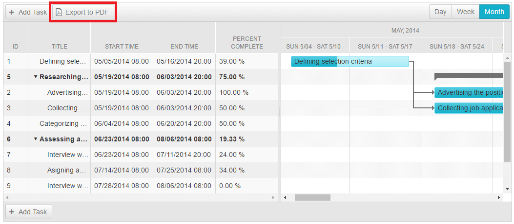

# PDF Export

This help article explains how to enable and configure **PDF Export** for **RadGantt**.

## Enable PDF Export

To enable the built-in PDF export functionality for **RadGantt** you should set its **EnablePdfExport** property to *true*:

````ASP.NET
<telerik:RadGantt runat="server" ID="RadGantt1" 
	RenderMode="Lightweight" 
	Height="450px"
	SelectedView="MonthView"
	EnablePdfExport="true">
</telerik:RadGantt>
````


Enabling the above property will force the **RadGantt** to display an **Export to PDF** button on its toolbar:




## Configure PDF Export

The **PDF Export** functionality is configurable. The **RadGantt** offers two ways to configure the export:

* by using the properties of the **ExportSettings** &gt; **PDF** element within the **RadGantt** mark-up declaration:

````ASP.NET
<telerik:RadGantt runat="server" ID="RadGantt1" 
	RenderMode="Lightweight" 
	Height="450px"
	SelectedView="MonthView"
	EnablePdfExport="true">
	<ExportSettings>
		<Pdf
			FileName="GanttPDF"
			MarginBottom="10mm"
			MarginLeft="10mm"
			MarginRight="10mm"
			MarginTop="10mm"/>
	</ExportSettings>
</telerik:RadGantt>
````


* by using the server-side API of the **RadGantt** object:

````C#
protected void Page_Load(object sender, EventArgs e)
{
	RadGantt1.ExportSettings.Pdf.FileName = "GanttPDF";
	RadGantt1.ExportSettings.Pdf.MarginBottom = "10mm";
	RadGantt1.ExportSettings.Pdf.MarginLeft = "10mm";
	RadGantt1.ExportSettings.Pdf.MarginRight = "10mm";
	RadGantt1.ExportSettings.Pdf.MarginTop = "10mm";
}
````
````VB
Protected Sub Page_Load(sender As Object, e As EventArgs)
	RadGantt1.ExportSettings.Pdf.FileName = "GanttPDF"
	RadGantt1.ExportSettings.Pdf.MarginBottom = "10mm"
	RadGantt1.ExportSettings.Pdf.MarginLeft = "10mm"
	RadGantt1.ExportSettings.Pdf.MarginRight = "10mm"
	RadGantt1.ExportSettings.Pdf.MarginTop = "10mm"
End Sub
````


# See Also

 * [PDF Export Demo](https://demos.telerik.com/aspnet-ajax/gantt/examples/functionality/pdf-export/defaultcs.aspx)

