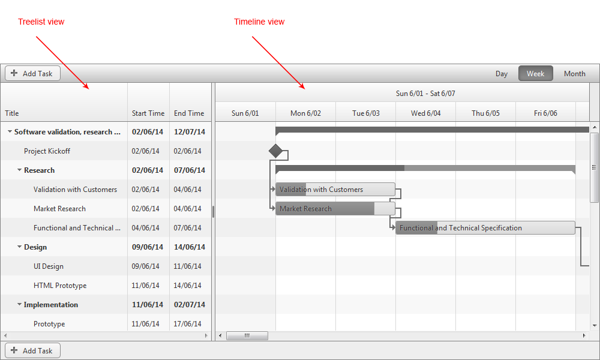

# RadGantt Structure

The following article describes the basic layout of the RadGantt

## RadGantt Layout

The **RadGantt** is divided into two main areas, separated by a slider : **Treelist and Timeline**. The Treelist view is placed in the left area of the RadGant, while the Timeline is on the right side.

* The **TreeList** portion of the **RadGantt** presents information about the individual tasks in a grid-like manner, where each row is a task, and each column is a different property. The **RadGantt** can be customized to determine which columns are visible.

* The **Timeline** area of the **Gantt** is responsible for visualizing the tasks. You could configure it by setting a preferable view, manage the tasks progress or alter their dependencies.The **Timeline** area is comprised of two main parts:

1. **TimeRuler** - The TimeRuler is placed at the top and indicates the divisions of time shown. Its purpose is to be a reference point for the different tasks’ start and end times, overall duration and potential overlap.

1. **Main Area** - The Main area is the place where the different tasks, milestones, summaries and relations between them are displayed. Each component (except the relations) is placed on a separate row, which corresponds to its respective row in the TreeList. If the task in the TreeList is not visible (because it’s parent summary is collapsed), the task is not visible in the Main area. The horizontal position of the component represents its start date, and its width – the duration.

The image below illustrates the Treelist and Timeline views.

# See Also

 * [Server-side Programming Overview]()
 
