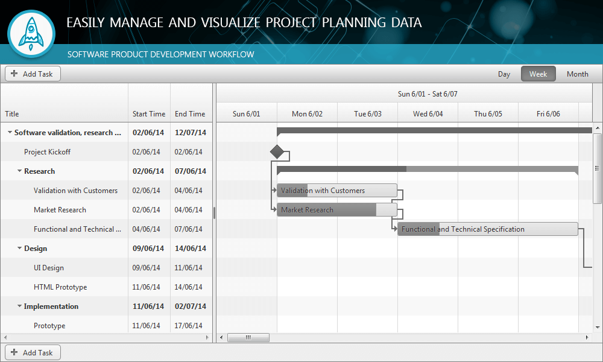

# Gantt Overview

**RadGantt** for ASP.NET AJAX is a type of bar chart that is used in project management to illustrate a project schedule. It provides visual information about the work breakdown structure of the project.

## 

**Telerik Gantt (Figure 1)** visualizes the different components of the project on a flexible timetable, making it easier to see:

* The project start date and deadline.

* Task summaries and their percentage of completion.

* Tasks and their start, end, duration and percentage of completion.

* Relations and overlap between tasks.

* Milestones.

* Current date (and where it is relative to the project).

**Figure 1**: Using RadGantt control you could easily manage any Task's configuration in a preferable View for serving out the data in a user-friendly manner.

## Key Features

* Rich UI for creating and managing tasks

* Day, Week, Month and Year views

* Customizable task edit capabilities

* Data Binding - Client-side and Server-side

* Integrated sorting, reordering and resizing

* Column Show/Hide

* Rich Client-side and Server-side API
