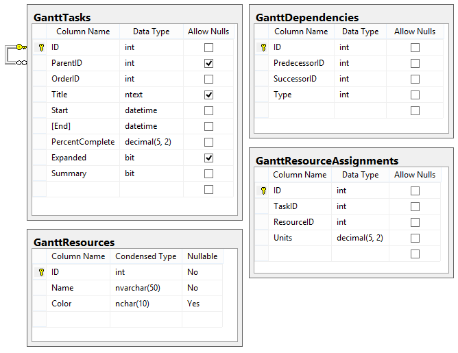

# Database Structure

To store **Gantt Resources** in a database it is needed to extend the [minimum requireddatabase structure](). Two additional tables are needed. The first will keep the resources data and the second will keep the Assignments. *GanttResourceAssignments* table represents themany to many relationship between the [Tasks]() and [Resources]().

## MSSQL Database Schema

Figure 1: The figure below demonstrates the tables for the RadGantt with enabled Resources.

You can use the following script to generate Gantt Resources database:

````SQL
CREATE DATABASE [Resources]
GO

USE [Resources]
GO

SET ANSI_NULLS ON
GO
SET QUOTED_IDENTIFIER ON
GO
CREATE TABLE [dbo].[GanttDependencies](
	[ID] [int] IDENTITY(1,1) NOT NULL,
	[PredecessorID] [int] NOT NULL,
	[SuccessorID] [int] NOT NULL,
	[Type] [int] NOT NULL,
 CONSTRAINT [PK_GanttDependencies] PRIMARY KEY CLUSTERED 
(
	[ID] ASC
)WITH (PAD_INDEX = OFF, STATISTICS_NORECOMPUTE = OFF, IGNORE_DUP_KEY = OFF, ALLOW_ROW_LOCKS = ON, ALLOW_PAGE_LOCKS = ON) ON [PRIMARY]
) ON [PRIMARY]

GO

SET ANSI_NULLS ON
GO
SET QUOTED_IDENTIFIER ON
GO
CREATE TABLE [dbo].[GanttResourceAssignments](
	[ID] [int] IDENTITY(1,1) NOT NULL,
	[TaskID] [int] NOT NULL,
	[ResourceID] [int] NOT NULL,
	[Units] [decimal](5, 2) NOT NULL,
 CONSTRAINT [PK_GanttResourceAssignments] PRIMARY KEY CLUSTERED 
(
	[ID] ASC
)WITH (PAD_INDEX = OFF, STATISTICS_NORECOMPUTE = OFF, IGNORE_DUP_KEY = OFF, ALLOW_ROW_LOCKS = ON, ALLOW_PAGE_LOCKS = ON) ON [PRIMARY]
) ON [PRIMARY]

GO

SET ANSI_NULLS ON
GO
SET QUOTED_IDENTIFIER ON
GO
CREATE TABLE [dbo].[GanttResources](
	[ID] [int] IDENTITY(1,1) NOT NULL,
	[Name] [nvarchar](50) NOT NULL,
	[Color] [nchar](10) NULL,
 CONSTRAINT [PK_GanttResources] PRIMARY KEY CLUSTERED 
(
	[ID] ASC
)WITH (PAD_INDEX = OFF, STATISTICS_NORECOMPUTE = OFF, IGNORE_DUP_KEY = OFF, ALLOW_ROW_LOCKS = ON, ALLOW_PAGE_LOCKS = ON) ON [PRIMARY]
) ON [PRIMARY]

GO

SET ANSI_NULLS ON
GO
SET QUOTED_IDENTIFIER ON
GO
CREATE TABLE [dbo].[GanttTasks](
	[ID] [int] IDENTITY(1,1) NOT NULL,
	[ParentID] [int] NULL,
	[OrderID] [int] NOT NULL,
	[Title] [ntext] NULL,
	[Start] [datetime] NOT NULL,
	[End] [datetime] NOT NULL,
	[PercentComplete] [decimal](5, 2) NOT NULL,
	[Expanded] [bit] NULL,
	[Summary] [bit] NOT NULL CONSTRAINT [DF_GanttTasks_Summary]  DEFAULT ((0)),
 CONSTRAINT [PK_GanttTasks] PRIMARY KEY CLUSTERED 
(
	[ID] ASC
)WITH (PAD_INDEX = OFF, STATISTICS_NORECOMPUTE = OFF, IGNORE_DUP_KEY = OFF, ALLOW_ROW_LOCKS = ON, ALLOW_PAGE_LOCKS = ON) ON [PRIMARY]
) ON [PRIMARY] TEXTIMAGE_ON [PRIMARY]

GO
ALTER TABLE [dbo].[GanttTasks]  WITH CHECK ADD  CONSTRAINT [FK_GanttTasks_GanttTasks] FOREIGN KEY([ParentID])
REFERENCES [dbo].[GanttTasks] ([ID])
GO
ALTER TABLE [dbo].[GanttTasks] CHECK CONSTRAINT [FK_GanttTasks_GanttTasks]
GO	
````

# See Also

 * [Tasks]()

 * [Resources]()

 * [Dependencies]()

 * [Basic Database Structure]()
