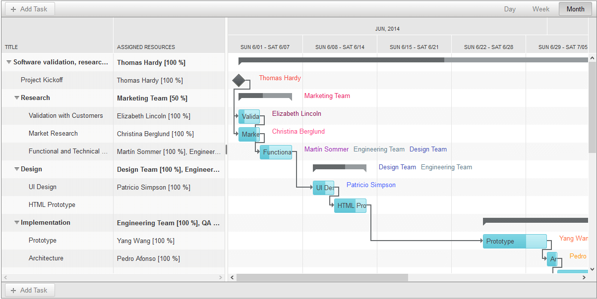
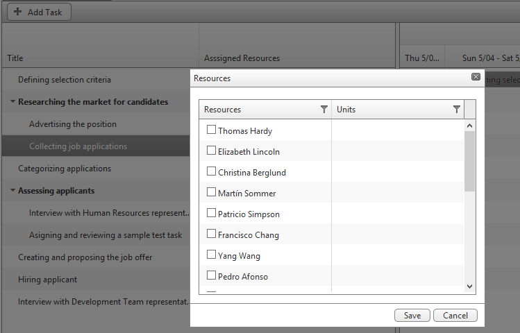
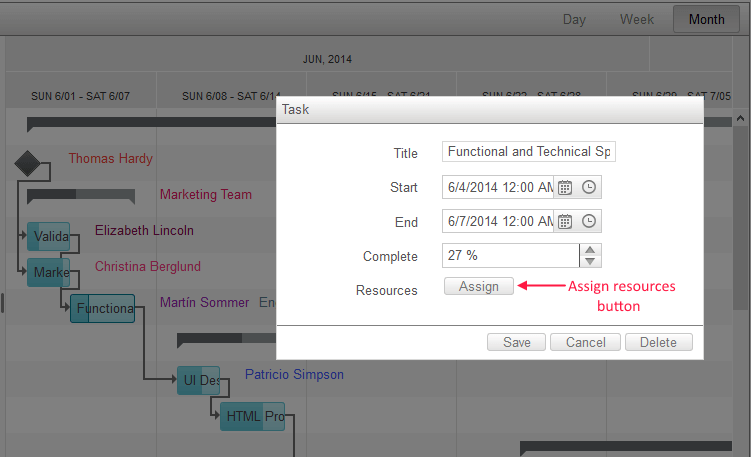

# Resources Overview

The following article describes the overall benefit and usage of the **Resources** of **RadGantt**

## Overview

As from **Q1 2015** release of the **Telerik UI for ASP.NET AJAX**, the RadGantt control provides full support for **Resources**. Using it, you will able to assign resources to your tasks, which could carry additional information for them. These resources might be people, materials, budget amount or anything else fitting your application. This could be very helpful in scenarios, where you need to associate people with the tasks in a particular project.

The **Resources** are enabled by setting the **EnableResources** property of the **RadGantt** to **true**. Each resource is defined by three fields : **ID, Text and Color**, where the **Color** is optional. The connection between **Tasks** and resources is done via **Assignments**. Each assignment is defined by an **ID**, **TaskID** and **ResourceID**. The assignment can also have a **Units** value associated with it, describing how much of each resource is taken up by the current task. Another optional column for the Resources is **Format**. This column define the format of the assignment **Units** and its default value is **percentage("p0")**.

## Visualization

The **Resources** are displayed next to the task that they are associated with in the **Timeline View**.The resources can also be visualized in the TreeList View with the **GanttResourceColumn**. The resources in the **Timeline View** could be colorized if the **ColorField** is defined (see **Figure 1**).

**Figure 1**: RadGantt with colorized Resources.

## Binding Resources

The **RadGantt** control allows the implementation of the **Resources** in each of its binding scenarios which are listed below:

* [Declarative Data Binding (SqlDataSource)]()

* [XML Provider Data Binding]()

* [Web Service DataBinding]()

* [Custom EntityFramework Provider Data Binding]()

## Editing Assignments

You can edit each Task’s assignments via a popup editor, which can be opened either by double-clicking on the resource cell in the **TreeList View** (see **Figure 2**), or through the **Assign** button in the **Advanced Edit Form**(see **Figure 3**) .

**Figure 2**: Assign Resources Popup.

**Figure 3**: Advanced Edit Form.

# See Also

 * [Resources Online Demo](http://demos.telerik.com/aspnet-ajax-beta/gantt/examples/functionality/resources/defaultcs.aspx)
