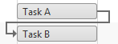
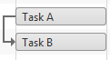
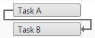

# Dependency

The following article describes the **Dependencies** between tasks and how they can be managed.

## Dependency Type

**A dependency** represents a relation between two components. The direction of the arrow indicated which component is dependent on the other. They could be created, deleted or customized from the Timeline area, in each of the views - **Day, Week, Month and Year**. You could use dependencies, in order to link the tasks and thus create the work-flow for a given summary task.

|  **Dependency Type**  |  **Example**  |  **Description**  |
| ------ | ------ | ------ |
|Finish to Start (FS)||The task cannot start before its predecessor task ends, although it may start later.|
|Start to Start (SS)||The task cannot start until the predecessor task starts, although it may start later.|
|Finish to Finish (FF)||The task cannot end before the predecessor task ends, although it may end later.|
|Start to Finish (SF)||The task cannot end before the predecessor task starts, although it may end later.|

## Dependency Properties

The table below demonstrates some general properties of the **Dependency** object.

| Name | Type | Description |
| ------ | ------ | ------ |
| **ID** |object|Gets or sets **Dependency** ID.|
| **PredecessorID** |object|Gets or sets pointer to the predecessor **GanttTask** using its ID.|
| **SuccessorID** |object|Gets or sets pointer to the successor **GanttTask** using its ID.|
| **Type** |Telerik.Web.UI.Gantt.DependencyType enumeration|Gets or sets the type of the **Dependency**.|

## Dependency Methods

The table below shows the publicly accessible methods of the **Dependency** object.

| Method | Parameters | Return type | Description |
| ------ | ------ | ------ | ------ |
| **GetData** |none|System.Collections.Specialized.IOrderedDictionary|Returns the **Dependency** data as an OrdrederDictionary.|
| **LoadFromDictionary** |System.Collections.IDictionary|void|Loads the **Dependency** data from a Dictionary.|

# See Also

 * [Server-side Programming Overview]()
 
 * [RadGantt object]()
 
 * [Tasks]()
 
 * [Assignments]()
 
 * [Resources]()
 
 * [Overview demo](http://demos.telerik.com/aspnet-ajax/gantt/examples/overview/defaultcs.aspx)
 
 