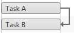

# Dependencies

The following article describes the Dependencies between tasks and how they can be managed.

## Dependencies

**The dependencies** represent the relations between two components. The direction of the arrow indicated which component is dependent on the other. They could be created, deleted or customized from the Timeline area, in each of the views - **Day, Week, Month and Year**. You could use dependencies, in order to link the tasks and thus create the work-flow for a given summary task.

|  **Dependency Type**  |  **Example**  |  **Description**  |
| ------ | ------ | ------ |
|Finish to Start (FS)||The task cannot start before its predecessor task ends, although it may start later.|
|Start to Start (SS)||The task cannot start until the predecessor task starts, although it may start later.|
|Finish to Finish (FF)||The task cannot end before the predecessor task ends, although it may end later.|
|Start to Finish (SF)||The task cannot end before the predecessor task starts, although it may end later.|
