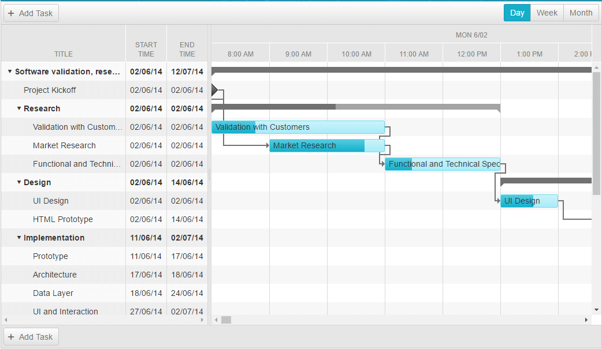

# Day View

The **Day View** shows all loaded tasks for a **RadGantt** distributed in columns that have duration of one hour. All those one-hour time spans that belong to a single day are grouped in one day time span. 

## DayViewSettings Object

**Table 1** demonstrates the properties that are available within the **DayViewSettings** object.

| Name | Type | Description |
| ------ | ------ | ------ |
| **DayHeaderDateFormat** |string|Gets or sets the day header date format string in **DayView**.|
| **HourSpan** |int|Gets or sets the hour span for each cell in **DayView**.|
| **RangeEnd** |DateTime?|Gets or sets the end date and time of the visible range on the **DayView**. The **RangeEnd** date will not be included within the visible range.|
| **RangeStart** |DateTime?|Gets or sets the start date and time of the visible range on the **DayView**.|
| **SelectedDate** |DateTime?|Gets or sets the date and time to which the timeline of the **DayView** is scrolled.|
| **SlotWidth** |Unit|Gets or sets the slot width in pixels for the **DayView**.|
| **TimeHeaderDateFormat** |string|Gets or sets the time header date format string in **DayView**.|
| **Type** |Telerik.Web.UI.GanttViewType enumeration|Gets the type of the **View**. In this case a **DayView**.|
| **UserSelectable** |bool|Gets or sets a value indicating whether to render a tab for the **DayView** in the view chooser.|

# See Also

 * [Views Overview]()
 
 * [Week View]()

 * [Month View]()

 * [Year View]()
 
 * [View types demo](https://demos.telerik.com/aspnet-ajax/gantt/examples/functionality/view-types/defaultcs.aspx)

