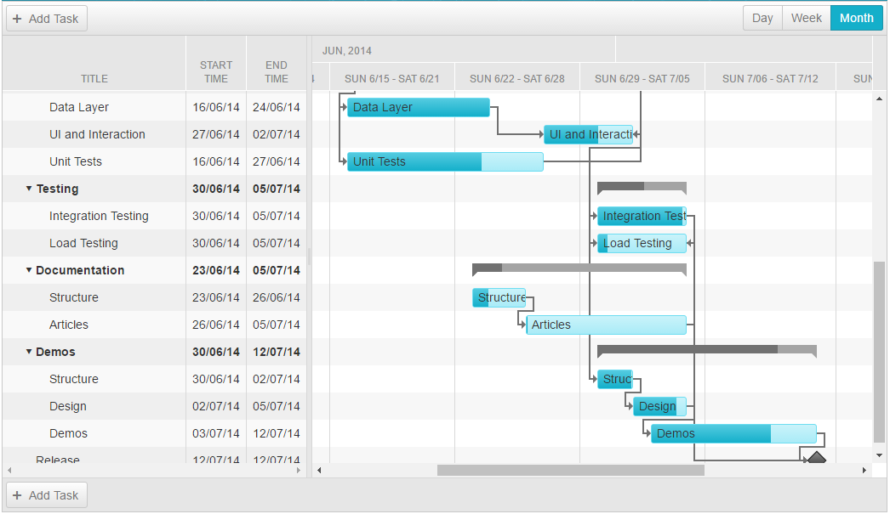

# Month View

The **Month View** shows all loaded tasks for a RadGantt, distributed in columns that have duration of one week. Months are displayed as super-headers of those columns. 

## Month View Settings:

**Table 1** demonstrates the properties, that are available within the **MonthViewSettings** object.

| Name | Type | Description |
| ------ | ------ | ------ |
| **MonthHeaderDateFormat** |string|Gets or sets the month header date format string in **MonthView**.|
| **SlotWidth** |Unit|Gets or sets the slot width in pixels for the respective view.|
| **Type** |Telerik.Web.UI.GanttViewType enumeration|Gets the type of the **View**, which the settings are applied to - Day, Week, Month or Year.|
| **UserSelectable** |bool|Gets or sets a value indicating whether to render a tab for the current view in the view chooser.|
| **WeekHeaderDateFormat** |string|Gets or sets the week header date format string in **MonthView**.|

# See Also

 * [Views Overview]()
 
 * [Day View]()

 * [Week View]()

 * [Year View]()
 
 * [View types demo](http://demos.telerik.com/aspnet-ajax/gantt/examples/functionality/view-types/defaultcs.aspx)

