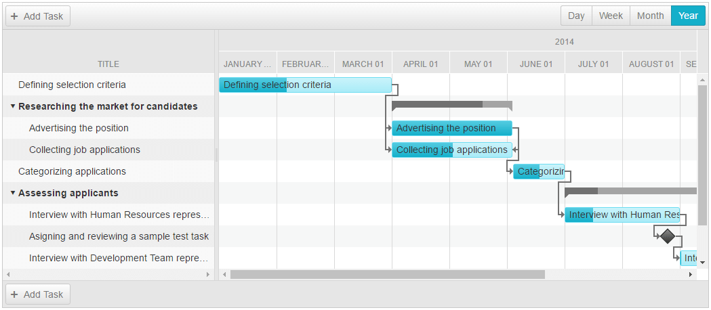

# Year View

The **Year View** shows all loaded tasks for a RadGantt, distributed in columns that have duration of one month. Those columns are further grouped in years.

## Year View Settings:

**Table 1** demonstrates the properties, that are available within the **YearViewSettings** object.

| Name | Type | Description |
| ------ | ------ | ------ |
| **MonthHeaderDateFormat** |string|Gets or sets the month header date format string in **YearView**.|
| **SlotWidth** |Unit|Gets or sets the slot width in pixels for the respective view.|
| **Type** |Telerik.Web.UI.GanttViewType enumeration|Gets the type of the **View**, which the settings are applied to - Day, Week, Month or Year.|
| **UserSelectable** |bool|Gets or sets a value indicating whether to render a tab for the current view in the view chooser.|
| **YearHeaderDateFormat** |string|Gets or sets the year header date format string in **YearView**.|

# See Also

 * [Views Overview]()
 
 * [Day View]()

 * [Week View]()

 * [Month View]()
 
 * [View types demo](http://demos.telerik.com/aspnet-ajax/gantt/examples/functionality/view-types/defaultcs.aspx)

