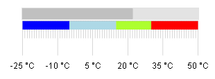
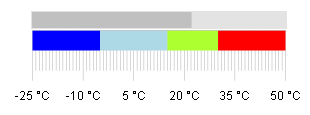
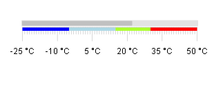
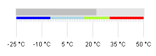

# LinearGauge Pointer and Range Size

## Configure Ranges Size

Changing the width of the ranges in RadLinearGauge can be done through the Size property of the MinorTicks:

````ASP.NET
<telerik:RadLinearGauge runat="server" id="RadLinearGauge_MinorTicksSize" Height="100px" Width="300px">
	<Pointer Value="22" Color="Silver">
	</Pointer>
	<Scale Min="-25" Max="50" MajorUnit="15" MinorUnit="1" MajorTicks-Size="50" MinorTicks-Size="25" Vertical="false">
		<Labels Format="{0} &deg;C" />
		<Ranges>
			<telerik:GaugeRange From="-25" To="-5" Color="Blue" />
			<telerik:GaugeRange From="-5" To="15" Color="LightBlue" />
			<telerik:GaugeRange From="15" To="30" Color="GreenYellow" />
			<telerik:GaugeRange From="30" To="50" Color="Red" />
		</Ranges>
	</Scale>
</telerik:RadLinearGauge>
````

MinorTick size property is set to "25":



MinorTick size property is set to "40":



## Configure Pointer Size

* When shape property of the Pointer is set to BarIndicator - the width of the Track must be used

* When shape property of the Pointer is set to Arrow - the size of the Pointer must be used

If Pointer size of the LinearGauge is not set it will be set proportionately by the current size of the MajorTicks.

````ASP.NET
<telerik:RadLinearGauge runat="server" ID="RadLinearGauge_MajorTicksSize" Height="100px" Width="300px">
	<Pointer Value="22" Color="Silver">
	</Pointer>
	<Scale Min="-25" Max="50" MajorUnit="15" MinorUnit="1" MajorTicks-Size="20" MinorTicks-Size="10" Vertical="false">
		<Labels Format="{0} &deg;C" />
		<Ranges>
			<telerik:GaugeRange From="-25" To="-5" Color="Blue" />
			<telerik:GaugeRange From="-5" To="15" Color="LightBlue" />
			<telerik:GaugeRange From="15" To="30" Color="GreenYellow" />
			<telerik:GaugeRange From="30" To="50" Color="Red" />
		</Ranges>
	</Scale>
</telerik:RadLinearGauge>
````

Pointer Size property is not set, MajorTicks-Size is set to "20" and MinorTicks-Size is set to "10":



Pointer Size property is not set, MajorTicks-Size is set to "40" and MinorTicks-Size is set to "10":


