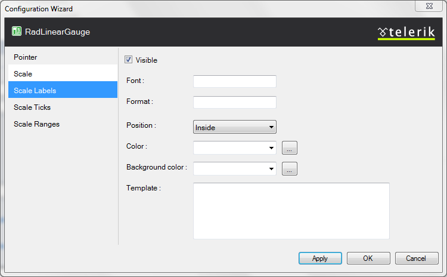
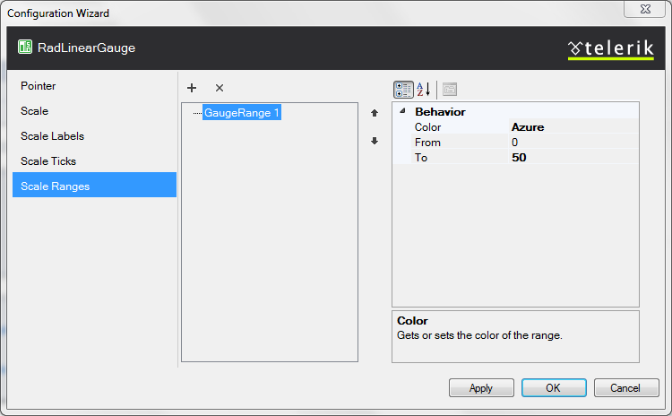

# Configuration Manager

The designers for the Linear and Radial gauges are very similar. On the left a series of tabs exposes the main visual elements of the control so that	the developer can configure their properties (or collections) on the right.

## Radial Gauge Specific Configuration

**Pointer**

The Pointer tab exposes the pointer and its cap, so they can be configured in terms of value, color and size.

**Scale**

The Scale tab exposes the main properties of the scale. Its inner tags are exposed in other tabs to simplify the designer.

## Linear Gauge Specific Configuration

**Pointer**

The Pointer tab exposes the pointer and its track, so they can be configured in terms of value, visibility, opacity, shape color and size.

**Scale**

The Scale tab exposes the main properties of the scale. Its inner tags are exposed in other tabs to simplify the designer.

## Common configuration

**Scale Labels**

The properties the labels have are exposed in one tab that is common for both gauge types

**Ticks**

The Ticks tab allows for configuration of the minor and major ticks - size, color, visibility.

**Scale Ranges**

The scale ranges collection items can be added/removed with the buttons in above the list and on the righttheir configuration is exposed - their From and To properties, as well as the color picker Microsoft provide.
