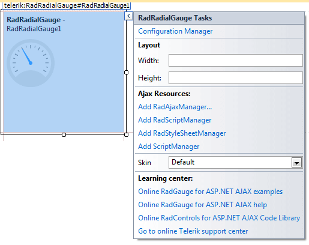
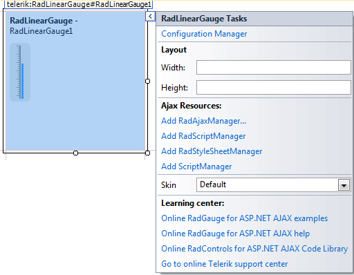

# Design Time Overview

The **RadGauge** offers a design-time support since its creation. The	advanced features are accessed through the **Smart Tag** of the control	by clicking on the [Configuration Manager]() link.

 

The basic functionality is similar to what other Telerik controls offer:

## Common Layout properties

Currently the layout configuration the RadGauge offers is its size. It is an important property when adjusting the real estate on the page and it is available in the root of the Smart Tag just below the configuration manager.

## Ajax Resources

* The **Add RadAjaxManager...** link adds a RadAjaxManager component to your Web page,so you can configure partial postbacks through a comfortable control.

* The **Replace ScriptManager with RadScriptManager** link replaces the default ScriptManager component that is used for AJAX-enabled Web sites with RadScriptManager. If there isn't a ScriptManager on the page this link will allow you to add one.

* The **AddRadStyleSheetManager** link adds a RadStyleSheetManager to your Web page.

## Choosing the Skin

The **Skin** dropdown lists all available skins for the control so you can select one that matches the look and feel of the rest of the page.The skins are displayed via small images to give you a better idea of the color scheme they use.

## Learning Center

The last section of the Smart Tag provides several links navigate you directly to the RadGauge online examples, help, or code library.
