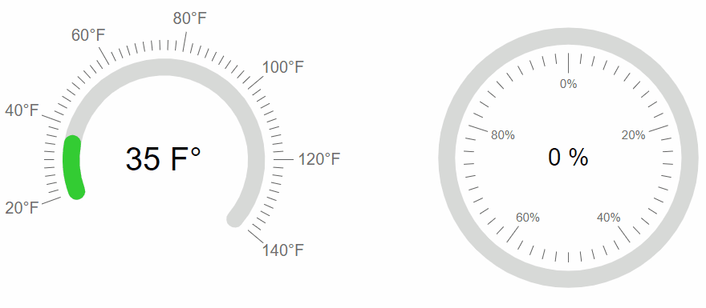

# Color Ranges

The RadArcGauge and RadCircularGauge Controls enables you to set different colors depending on the current value of the Gauge.

To configure the range colors, define `ArcGaugeColor` elements within the `ColorsCollection` inner tag. Each Color element has covers a range `From` - `To`, and has its own color specified.




````ASP.NET
<telerik:RadArcGauge runat="server" ID="RadArcGauge1" Height="350" Width="350" Font-Size="XX-Large" Skin="Silk" Value="35">
    <CenterTemplate>
        #:value # F&deg;
    </CenterTemplate>
    <Scale Min="20" Max="140" StartAngle="-20" EndAngle="220">
        <Labels Visible="true" Position="Outside" Font="16px Arial,Helvetica,sans-serif" Format="{0}&deg;F" />
        <MajorTicks Visible="true" Size="20" Color="Black" />
        <MinorTicks Visible="true" Color="Black" />
    </Scale>
    <ColorsCollection>
        <telerik:ArcGaugeColor From="20" To="49" Color="#33cc33" />
        <telerik:ArcGaugeColor From="50" To="69" Color="#ffcc66" />
        <telerik:ArcGaugeColor From="70" To="109" Color="#ff3300" />
        <telerik:ArcGaugeColor From="110" To="140" Color="#990000" />
    </ColorsCollection>
</telerik:RadArcGauge>

<telerik:RadCircularGauge runat="server" ID="RadCircularGauge1" Height="350" Width="350" Font-Size="X-Large" Skin="Silk" Value="0">
    <CenterTemplate>
        #:value # %
    </CenterTemplate>
    <Scale Min="0" Max="100">
        <Labels Visible="true" Position="Inside" Font="12px Arial,Helvetica,sans-serif" Format="{0}%" />
        <MajorTicks Visible="true" Size="20" Color="Black" />
        <MinorTicks Visible="true" Color="Black" />
    </Scale>
    <ColorsCollection>
        <telerik:ArcGaugeColor From="0" To="24" Color="#990000" />
        <telerik:ArcGaugeColor From="25" To="49" Color="#ff3300" />
        <telerik:ArcGaugeColor From="50" To="74" Color="#ffcc66" />
        <telerik:ArcGaugeColor From="75" To="100" Color="#33cc33" />
    </ColorsCollection>
</telerik:RadCircularGauge>
````

The animation in the image above is achieved with dynamically increasing the value of the Gauge with the following custom JavaScript logic

````JavaScript
function pageLoad() {
    var arcGauge = $find("<%=RadArcGauge1.ClientID %>");
    var circularGauge = $find("<%=RadCircularGauge1.ClientID %>");
    heatUp(arcGauge, 115);
    heatUp(circularGauge, 89);
}

function heatUp(gauge, targetValue) {
    var currentValue = gauge.get_value();
    if (gauge.get_value() < targetValue) {
        setTimeout(function () {
            gauge.set_value(currentValue + 1);
            heatUp(gauge, targetValue);
        }, 30)
    }
}
````

Check out our live demo of this functionality: [Color Ranges](https://demos.telerik.com/aspnet-ajax/gauge/examples/color-ranges/defaultcs.aspx).

## See Also

 * [Color Ranges](https://demos.telerik.com/aspnet-ajax/gauge/examples/color-ranges/defaultcs.aspx)
 
 * [Arc]()

 * [Circular]()
