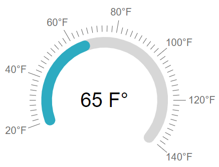

# Arc

The Telerik **RadArcGauge** is a Control representing a value on a circular arc. It offers a customizable scale and appearance.

The ArcGauge UI Control for ASP.NET AJAX is available as of R2 2023. The RadArcGauge a server-side WebForms wrapper over the [Kendo UI ArcGauge for jQuery widget](https://docs.telerik.com/kendo-ui/controls/gauges/arcgauge/overview).



To get an idea which element corresponds to which tag check the [RadGauge Structure]() article. The above gauge was created with the following markup:

````ASP.NET
<telerik:RadArcGauge runat="server" ID="RadArcGauge1" Height="350" Width="350" Font-Size="XX-Large" Skin="Silk" Value="35">
    <CenterTemplate>
        #:value # F&deg;
    </CenterTemplate>
    <Scale Min="20" Max="140" StartAngle="-20" EndAngle="220">
        <Labels Visible="true" Position="Outside" Font="16px Arial,Helvetica,sans-serif" Format="{0}&deg;F" />
        <MajorTicks Visible="true" Size="20" Color="Black" />
        <MinorTicks Visible="true" Color="Black" />
    </Scale>
</telerik:RadArcGauge>
````

The control offers more customization options than the ones shown above:

* **Center Template** - You can customize the content inside the center of the ArcGauge by using the center template.  RadArcGauge uses [Kendo UI Templates](https://docs.telerik.com/kendo-ui/framework/templates/overview) to provide full control over the rendering of center element. To evaluate the current value of the Gauge in its center element use `#:value#`.

* **Basic Scale configuration** - the `Scale` is the main wrapper of the control and details are configurable through inner properties. The main `Scale` tag, however, offers the basic functionality - the `Min` and `Max` values of the gauge, the `MajorUnit` and `MinorUnit` properties that control the ticks and label distance,and the `Reverse` property which shows the higher values first when set to true. The specific properties here are `StartAngle` and `EndAngle` which control the angle from which the gauge's dial starts and at which it ends. The difference between them must be less than 360 degrees and they can also take negative values so that the gauge rotates from the default vertical centering.

* **Labels configuration** - you can choose the `BackgroundColor`, `Color` and `Font` to customize their appearance. The `Visible` property controls if they are shown and the `Format` takes a format string that will be applied to the text according to the value. The format string uses the `{0}` placeholder to indicate the value. The `Template` property is a client template similar to the format - it takes a similar string to show in the labels, but the value placeholder is `#=value#`. The `Position` property controls whether the labels are inside or outside of the dial.

* **Ticks configuration** - the `MajorTicks` and `MinorTicks` inner tags expose the small lines that protrude from the ranges to show the value. They offer various options for customization - `Color`, `Size` or `Width` (in pixels) and `Visible` (boolean).

* **Color Ranges configuration** - the `ColorsCollection` tag can contain multiple `ArcGaugeColor` tags that represent the areas of the gauge that will show differently than the regular scale. Each color range has the `From` and `To` properties that control is positioning on the scale and also the `Color` property that can be used to specify their fill.

* **Main gauge configuration** - the `Appearance` tag of the control allows for customizing its entire look. It offers the `BackgroundColor` property which sets the wrapper's background fill and also `Height`, `Width`, and `Margin` defining the size of the wrapper and the distance between the Gauge itself and the contour of its wrapper.


Try out various of the customization options in our [live demo](https://demos.telerik.com/aspnet-ajax/gauge/examples/types/arcgauge/defaultcs.aspx).


## See Also

 * [RadGauge Structure]()
 
 * [Circular]()

 * [Linear]()

 * [Radial]()

 * [Demo: Arc Gauge](https://demos.telerik.com/aspnet-ajax/gauge/examples/types/arcgauge/defaultcs.aspx)


